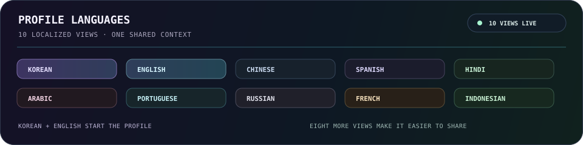
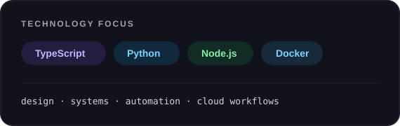

  <a href="./README.md">🇺🇸 English</a> ·
  <a href="./README.ko.md">🇰🇷 한국어</a> ·
  <a href="./README.zh-CN.md">🇨🇳 中文</a> ·
  <a href="./README.es.md"><strong>🇪🇸 Español</strong></a> ·
  <a href="./README.hi.md">🇮🇳 हिन्दी</a> 
  <a href="./README.ar.md">🇸🇦 العربية</a> ·
  <a href="./README.pt-BR.md">🇧🇷 Português</a> ·
  <a href="./README.ru.md">🇷🇺 Русский</a> ·
  <a href="./README.fr.md">🇫🇷 Français</a> ·
  <a href="./README.id.md">🇮🇩 Bahasa Indonesia</a>

  
  

  <a href="https://github.com/KS-GG-AI?tab=repositories"><kbd>&nbsp; Explorar repositorios &nbsp;</kbd></a>
  &nbsp;
  <a href="https://github.com/KS-GG-AI/KS-GG-AI"><kbd>&nbsp; Ver código del perfil &nbsp;</kbd></a>

## En qué trabajo

Construyo las partes de un producto que deberían sentirse simples incluso cuando el trabajo detrás no lo es: interfaces claras, herramientas conectadas y flujos repetibles. Gran parte del trabajo vive donde se cruzan el producto, la automatización y los sistemas.

- **Superficies de producto** — Interfaces y flujos que hacen evidente el siguiente paso
- **Trabajo conectado** — API, integraciones y automatización que reducen traspasos rutinarios
- **Hecho para evolucionar** — Bases pequeñas y fáciles de probar, cambiar y mantener

## Idiomas del perfil

Este perfil está disponible en diez idiomas. Coreano e inglés son los puntos de partida; las demás versiones localizadas facilitan compartir el mismo trabajo entre regiones.

## Caja de herramientas

Un conjunto práctico de herramientas para escribir, conectar, entregar y mantener el software en movimiento.

 

<i>Haz que el camino útil sea fácil de seguir.</i>

## Habilidades y tecnologías

Es un mapa de trabajo, no una lista de control. Las tecnologías se agrupan según el problema que ayudan a resolver.

