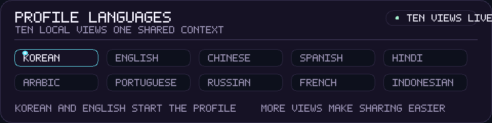
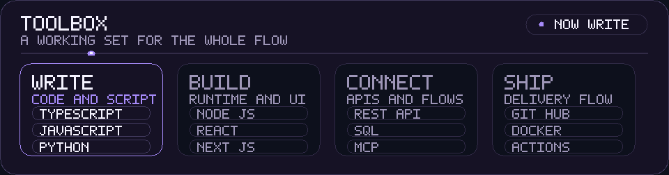
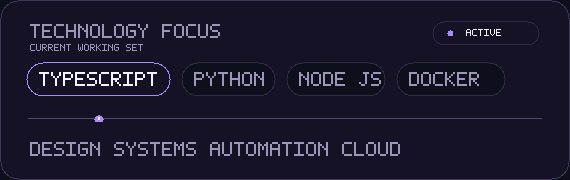

  <a href="./README.md">🇺🇸 English</a> ·
  <a href="./README.ko.md">🇰🇷 한국어</a> ·
  <a href="./README.zh-CN.md">🇨🇳 中文</a> ·
  <a href="./README.es.md">🇪🇸 Español</a> ·
  <a href="./README.hi.md">🇮🇳 हिन्दी</a> 
  <a href="./README.ar.md">🇸🇦 العربية</a> ·
  <a href="./README.pt-BR.md">🇧🇷 Português</a> ·
  <a href="./README.ru.md">🇷🇺 Русский</a> ·
  <a href="./README.fr.md"><strong>🇫🇷 Français</strong></a> ·
  <a href="./README.id.md">🇮🇩 Bahasa Indonesia</a>

  
  

  <a href="https://github.com/KS-GG-AI?tab=repositories"><kbd>&nbsp; Voir les dépôts &nbsp;</kbd></a>
  &nbsp;
  <a href="https://github.com/KS-GG-AI/KS-GG-AI"><kbd>&nbsp; Voir le code du profil &nbsp;</kbd></a>

## Sur quoi je travaille

Je construis les parties d’un produit qui doivent paraître simples, même lorsque le travail derrière ne l’est pas : interfaces claires, outils connectés et workflows reproductibles. L’essentiel se situe à la rencontre du produit, de l’automatisation et des systèmes.

- **Surfaces produit** — Interfaces et parcours qui rendent la prochaine action évidente
- **Travail connecté** — API, intégrations et automatisation qui réduisent les transmissions répétitives
- **Pensé pour évoluer** — De petites fondations faciles à tester, modifier et maintenir

## Langues du profil

Ce profil est disponible en dix langues. Le coréen et l’anglais sont les points de départ ; les autres versions localisées facilitent le partage du même contexte entre régions.

## Boîte à outils

Un ensemble pratique d’outils pour écrire, connecter, livrer et faire avancer le logiciel.

 

<i>Rendre le chemin utile facile à suivre.</i>

## Compétences et technologies

C’est une carte de travail, pas une checklist. Les technologies sont regroupées selon les problèmes qu’elles aident à résoudre.

