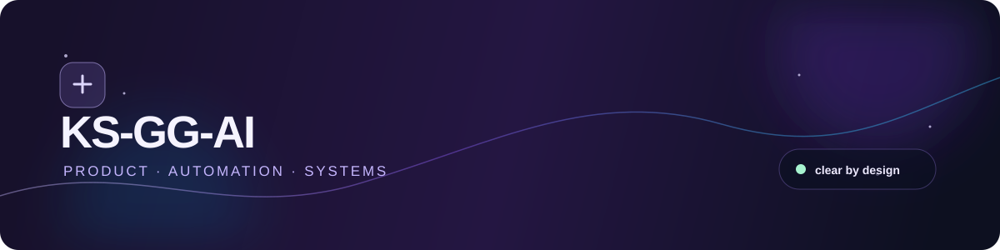
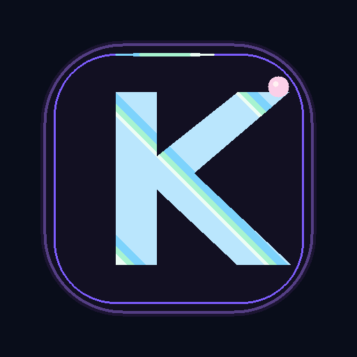
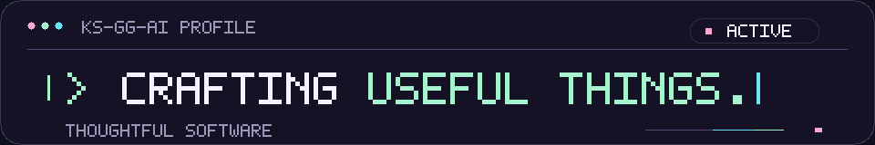
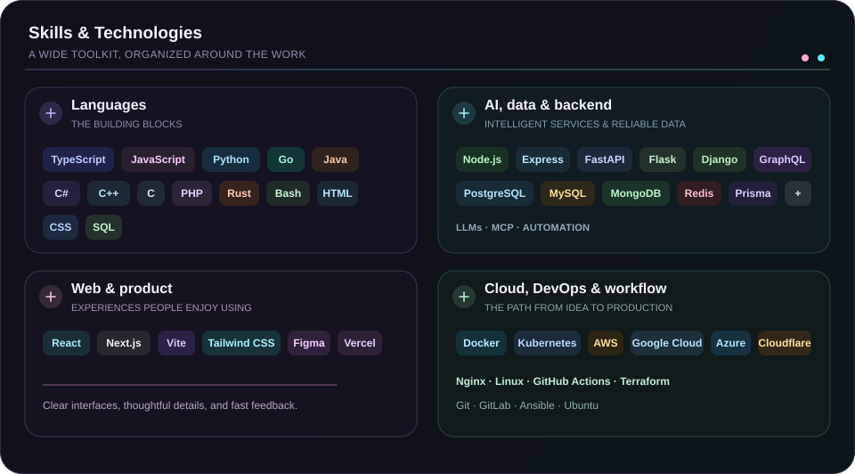

  
  

  <strong>कोड, जिज्ञासा और सावधानी से विचारों को आकार देता हूँ।</strong> 
  स्पष्ट इंटरफ़ेस · जुड़े हुए वर्कफ़्लो · भरोसेमंद सिस्टम

  <a href="./README.md">🇺🇸 English</a> ·
  <a href="./README.ko.md">🇰🇷 한국어</a> ·
  <a href="./README.zh-CN.md">🇨🇳 中文</a> ·
  <a href="./README.es.md">🇪🇸 Español</a> ·
  <strong>🇮🇳 हिन्दी</strong> 
  <a href="./README.ar.md">🇸🇦 العربية</a> ·
  <a href="./README.pt-BR.md">🇧🇷 Português</a> ·
  <a href="./README.ru.md">🇷🇺 Русский</a> ·
  <a href="./README.fr.md">🇫🇷 Français</a> ·
  <a href="./README.id.md">🇮🇩 Bahasa Indonesia</a>

## सार्वजनिक काम

**प्रोफ़ाइल सिस्टम** — रिपॉज़िटरी में रखे विज़ुअल, पढ़ने योग्य Markdown विकल्पों और नियमित रूप से अपडेट होने वाले सार्वजनिक प्रोजेक्ट मैप वाला बहुभाषी GitHub प्रोफ़ाइल।

[प्रोफ़ाइल रिपॉज़िटरी खोलें](https://github.com/KS-GG-AI/KS-GG-AI) · [सार्वजनिक रिपॉज़िटरी देखें](https://github.com/KS-GG-AI?tab=repositories)

  

## मैं क्या बनाता हूँ

मैं किसी उत्पाद के उन हिस्सों को बनाता हूँ जो पीछे के जटिल काम के बावजूद उपयोग में सरल लगने चाहिए — स्पष्ट इंटरफ़ेस, जुड़े हुए टूल और दोहराए जा सकने वाले वर्कफ़्लो। मेरा अधिकांश काम प्रोडक्ट सोच, ऑटोमेशन और सिस्टम के मिलन बिंदु पर होता है।

- **प्रोडक्ट अनुभव** — ऐसे इंटरफ़ेस और फ्लो जिनमें अगला कदम तुरंत दिखे
- **जुड़ा हुआ काम** — API, इंटीग्रेशन और ऑटोमेशन जो रोज़मर्रा के हैंड-ऑफ कम करें
- **बदलाव के लिए तैयार** — छोटे आधार जिन्हें टेस्ट, बदलना और बनाए रखना आसान हो

## प्रोजेक्ट मैप

सार्वजनिक प्रोजेक्ट और सुरक्षित निजी काम का एक संक्षिप्त दृश्य। यह नियमित शेड्यूल पर अपने-आप अपडेट होता है।

- **सार्वजनिक काम** — [वर्तमान सार्वजनिक रिपॉज़िटरी सूची देखें](https://github.com/KS-GG-AI?tab=repositories)।
- **निजी काम** — जानबूझकर छिपाया जाता है; नाम और मेटाडेटा यहाँ कभी नहीं दिखते।

<strong>प्रोजेक्ट मैप देखें</strong>

 

निजी नाम और मेटाडेटा कभी नहीं दिखाए जाते। <a href="https://github.com/KS-GG-AI?tab=repositories">सार्वजनिक रिपॉज़िटरी देखें</a>।

## मैं कैसे काम करता हूँ

निर्णयों को पढ़ने में आसान और अगले कदम को साफ़ रखता हूँ: छोटा शुरू करता हूँ, जल्दी सीखता हूँ और इरादे के साथ सुधारता हूँ।

<strong>काम के तीन सिद्धांत देखें</strong>

 

- **स्पष्टता पहले** — अगले कदम को स्पष्ट रखें।
- **जिज्ञासु रहें** — बेहतर तरीके खोजने की जगह बनाए रखें।
- **सुधार जारी रखें** — छोटे बदलावों को लगातार जोड़ें।

 

## मुख्य उपकरण

कोड लिखने, इंटरफ़ेस बनाने, सिस्टम जोड़ने और बदलाव पहुँचाने के लिए एक केंद्रित टूलसेट।

<strong>मुख्य टूलसेट देखें</strong>

 

- **लिखें** — TypeScript, JavaScript, Python
- **बनाएँ** — Node.js, React, Next.js
- **जोड़ें** — REST API, SQL, MCP
- **डिलीवर करें** — Git, Docker, GitHub Actions

 

## कौशल और प्रौद्योगिकियाँ

यह काम का नक्शा है, चेकलिस्ट नहीं। तकनीकों को उन समस्याओं के अनुसार समूहित किया गया है जिन्हें वे हल करने में मदद करती हैं।

मुख्य कार्य-सेट TypeScript, JavaScript, Python, Node.js, React, Next.js, REST API, SQL, Docker और GitHub Actions है। अतिरिक्त संदर्भ चाहिए तो नीचे पूरा नक्शा खोलें।

<strong>पूरा तकनीकी नक्शा देखें</strong>

 

मूवमेंट वाला संस्करण चाहिए? <a href="./assets/technology-stack.gif">GIF नक्शा खोलें</a>।

 

- **भाषाएँ और मार्कअप** — TypeScript, JavaScript, Python, Go, Java, C#, C++, C, PHP, Rust, Bash, HTML, CSS, SQL
- **सेवाएँ, डेटा और ऑटोमेशन** — Node.js, Express, FastAPI, Flask, Django, GraphQL, PostgreSQL, MySQL, MongoDB, Redis, Prisma, LLMs, MCP, ऑटोमेशन
- **इंटरफ़ेस और प्रोडक्ट** — React, Next.js, Vite, Tailwind CSS, Figma, Vercel
- **डिलीवरी और ऑपरेशंस** — Docker, Kubernetes, AWS, Google Cloud, Azure, Cloudflare, Nginx, Linux, GitHub Actions, Terraform, Git, GitLab, Ansible, Ubuntu

