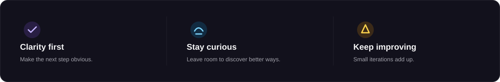

  
  

  <strong>코드, 호기심, 그리고 세심함으로 아이디어를 현실로 만듭니다.</strong> 
  명확한 인터페이스 · 연결된 워크플로 · 믿을 수 있는 시스템

  <a href="./README.md">🇺🇸 English</a> ·
  <strong>🇰🇷 한국어</strong> ·
  <a href="./README.zh-CN.md">🇨🇳 中文</a> ·
  <a href="./README.es.md">🇪🇸 Español</a> ·
  <a href="./README.hi.md">🇮🇳 हिन्दी</a> 
  <a href="./README.ar.md">🇸🇦 العربية</a> ·
  <a href="./README.pt-BR.md">🇧🇷 Português</a> ·
  <a href="./README.ru.md">🇷🇺 Русский</a> ·
  <a href="./README.fr.md">🇫🇷 Français</a> ·
  <a href="./README.id.md">🇮🇩 Bahasa Indonesia</a>

## 공개 작업

**프로필 시스템** — 저장소 안의 시각 자산, 읽기 쉬운 Markdown 대체 정보, 정기 갱신되는 공개 프로젝트 지도로 구성한 다국어 GitHub 프로필입니다.

[프로필 저장소 열기](https://github.com/KS-GG-AI/KS-GG-AI) · [공개 저장소 보기](https://github.com/KS-GG-AI?tab=repositories)

  

## 만드는 것

복잡한 일도 쓰는 사람에게는 단순하게 느껴지도록 만듭니다. 다음 행동이 보이는 인터페이스, 도구 사이의 자연스러운 연결, 반복 가능한 워크플로를 제품 관점·자동화·시스템 설계의 접점에서 다룹니다.

- **제품 흐름** — 다음 행동이 자연스럽게 보이는 인터페이스와 흐름
- **연결된 작업** — 반복적인 전달을 줄이는 API, 연동, 자동화
- **변화를 견디는 기반** — 테스트, 수정, 유지보수가 쉬운 작은 기반

## 프로젝트 지도

공개 프로젝트와 보호된 비공개 작업을 나눈 간결한 지도입니다. 정기 실행으로 자동 갱신됩니다.

- **공개 작업** — [현재 공개 저장소 보기](https://github.com/KS-GG-AI?tab=repositories)
- **비공개 작업** — 이름과 메타데이터를 의도적으로 숨기며, 이곳에 표시하지 않습니다.

<strong>프로젝트 지도 보기</strong>

 

비공개 이름과 메타데이터는 표시하지 않습니다. <a href="https://github.com/KS-GG-AI?tab=repositories">공개 저장소 보기</a>

## 로드맵

공개 이슈 라벨을 기준으로 현재 방향과 전달 흐름을 보여줍니다. 비공개 항목을 읽거나 표시하지 않으며, 정기 실행으로 갱신됩니다.

- **프로젝트 방향** — 지금, 다음, 이후
- **개발 흐름** — 계획, 구현, 검증, 배포

<strong>공개 로드맵 보기</strong>

 

<strong>프로젝트 로드맵</strong>

<strong>개발 로드맵</strong>

공개 GitHub 이슈만 사용합니다. 이슈가 보이게 하려면 <code>roadmap:*</code> 라벨 하나와 <code>stage:*</code> 라벨 하나를 붙이면 됩니다.

 

[공개 추적 이슈 보기](https://github.com/issues?q=user%3AKS-GG-AI+is%3Aissue+is%3Aopen)

## 일하는 방식

결정은 읽기 쉽게, 다음 단계는 눈에 보이게 둡니다. 작게 시작하고, 빠르게 배우고, 의도를 갖고 개선합니다.

<strong>세 가지 일하는 원칙 보기</strong>

 

- **명확성을 먼저** — 다음 행동이 자연스럽게 보이도록 만듭니다.
- **호기심 유지** — 더 나은 방법을 찾을 여지를 남깁니다.
- **계속 개선** — 작은 반복을 차분히 쌓습니다.

 

## 핵심 도구

작성, 인터페이스 구성, 시스템 연결, 변경 배포에 쓰는 도구를 흐름 중심으로 정리했습니다.

<strong>핵심 도구 구성 보기</strong>

 

- **작성** — TypeScript, JavaScript, Python
- **구성** — Node.js, React, Next.js
- **연결** — REST API, SQL, MCP
- **배포** — Git, Docker, GitHub Actions

 

## 기술과 도구

이것은 체크리스트가 아닌 작업 지도입니다. 기술은 어떤 문제를 해결하는지에 따라 묶었습니다.

핵심 작업 세트는 TypeScript, JavaScript, Python, Node.js, React, Next.js, REST API, SQL, Docker, GitHub Actions입니다. 전체 맥락이 필요할 때 아래 지도를 열 수 있습니다.

<strong>전체 기술 지도 보기</strong>

 

움직이는 버전이 필요하다면 <a href="./profile/assets/motion/technology-stack.gif">GIF 지도 보기</a>.

 

- **언어와 마크업** — TypeScript, JavaScript, Python, Go, Java, C#, C++, C, PHP, Rust, Bash, HTML, CSS, SQL
- **서비스·데이터·자동화** — Node.js, Express, FastAPI, Flask, Django, GraphQL, PostgreSQL, MySQL, MongoDB, Redis, Prisma, LLMs, MCP, 자동화
- **인터페이스와 프로덕트** — React, Next.js, Vite, Tailwind CSS, Figma, Vercel
- **배포와 운영** — Docker, Kubernetes, AWS, Google Cloud, Azure, Cloudflare, Nginx, Linux, GitHub Actions, Terraform, Git, GitLab, Ansible, Ubuntu

