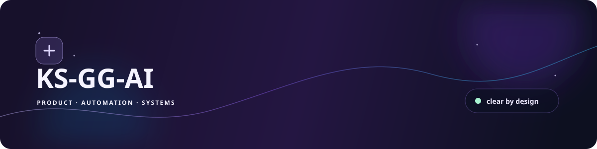
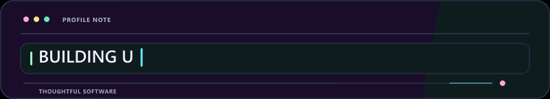
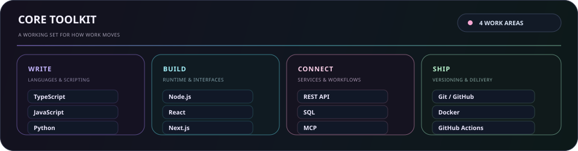
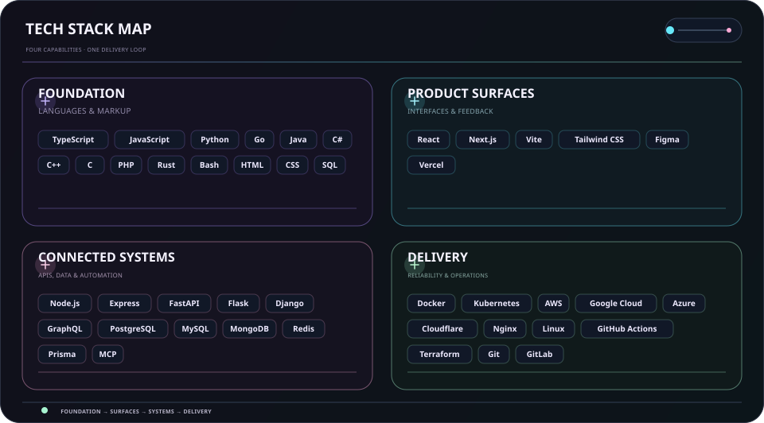
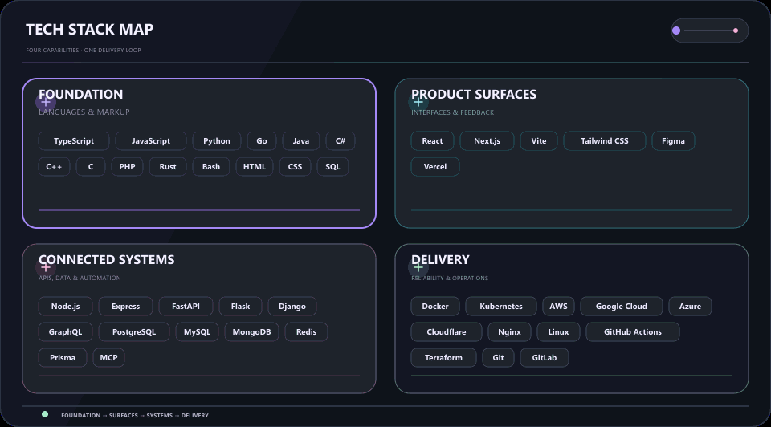

  
  

  <strong>Building ideas with code, curiosity, and care.</strong> 
  Clear interfaces · connected workflows · reliable systems.

  <strong>🇺🇸 English</strong> ·
  <a href="./profile/content/locales/ko.md">🇰🇷 한국어</a> ·
  <a href="./profile/content/locales/zh-CN.md">🇨🇳 中文</a> ·
  <a href="./profile/content/locales/es.md">🇪🇸 Español</a> ·
  <a href="./profile/content/locales/hi.md">🇮🇳 हिन्दी</a> 
  <a href="./profile/content/locales/ar.md">🇸🇦 العربية</a> ·
  <a href="./profile/content/locales/pt-BR.md">🇧🇷 Português</a> ·
  <a href="./profile/content/locales/ru.md">🇷🇺 Русский</a> ·
  <a href="./profile/content/locales/fr.md">🇫🇷 Français</a> ·
  <a href="./profile/content/locales/id.md">🇮🇩 Bahasa Indonesia</a>

## About

I turn early ideas into useful product surfaces, connected tools, and workflows that stay understandable as they grow.

  

### What I build

- **Product surfaces** — Interfaces and flows that make the next action obvious
- **Connected work** — APIs, integrations, and automation that reduce routine hand-offs
- **Built to evolve** — Small foundations that stay easy to test, change, and maintain

### How I work

- **Clarity first** — Make the next step obvious.
- **Stay curious** — Leave room to discover better ways.
- **Keep improving** — Let small iterations add up.

Make it useful. Make it clear. Keep making it better.

## Stack

A practical working set, grouped by the job it helps with rather than treated as a checklist.

- **Foundation** — TypeScript, JavaScript, Python, Go
- **Product surfaces** — React, Next.js, Vite, Tailwind CSS, Figma
- **Connected systems** — Node.js, REST APIs, PostgreSQL, MCP
- **Delivery & reliability** — Git, Docker, GitHub Actions, cloud platforms

<strong>Explore the visual stack</strong>

 

<strong>Core toolkit</strong>

<strong>Technical map</strong>

<strong>In motion</strong>

- **Languages & markup** — TypeScript, JavaScript, Python, Go, Java, C#, C++, C, PHP, Rust, Bash, HTML, CSS, SQL
- **Services, data & automation** — Node.js, Express, FastAPI, Flask, Django, GraphQL, PostgreSQL, MySQL, MongoDB, Redis, Prisma, LLMs, MCP, automation
- **Interfaces & product** — React, Next.js, Vite, Tailwind CSS, Figma, Vercel
- **Delivery & operations** — Docker, Kubernetes, AWS, Google Cloud, Azure, Cloudflare, Nginx, Linux, GitHub Actions, Terraform, Git, GitLab, Ansible, Ubuntu

## Projects

Public work stays easy to browse; private work stays intentionally masked. The maps below refresh from public repository and issue data only.

[Browse public repositories](https://github.com/KS-GG-AI?tab=repositories) · [Browse public tracked issues](https://github.com/issues?q=user%3AKS-GG-AI+is%3Aissue+is%3Aopen)

<strong>Explore projects and roadmaps</strong>

 

<strong>Project map</strong>

Public metadata only. Private names and metadata are never shown.

<strong>Project roadmap</strong>

<strong>Development roadmap</strong>

Uses public GitHub issues only. Add one <code>roadmap:*</code> label and one <code>stage:*</code> label to a public issue to make it appear.

## Contact

For public work, feedback, or a closer look at the implementation, these are the clearest starting points.

[GitHub profile](https://github.com/KS-GG-AI) · [Public repositories](https://github.com/KS-GG-AI?tab=repositories) · [Open an issue](https://github.com/KS-GG-AI/KS-GG-AI/issues/new) · [Profile source](https://github.com/KS-GG-AI/KS-GG-AI)
