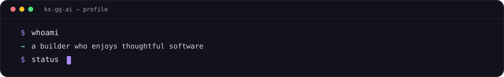
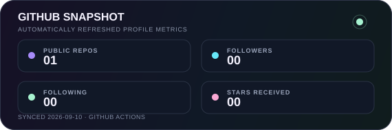

  <a href="./README.md">🇺🇸 English</a> ·
  <a href="./README.ko.md">🇰🇷 한국어</a> ·
  <a href="./README.zh-CN.md">🇨🇳 中文</a> ·
  <a href="./README.es.md">🇪🇸 Español</a> ·
  <a href="./README.hi.md">🇮🇳 हिन्दी</a> 
  <a href="./README.ar.md">🇸🇦 العربية</a> ·
  <a href="./README.pt-BR.md">🇧🇷 Português</a> ·
  <a href="./README.ru.md"><strong>🇷🇺 Русский</strong></a> ·
  <a href="./README.fr.md">🇫🇷 Français</a> ·
  <a href="./README.id.md">🇮🇩 Bahasa Indonesia</a>

<table>
  <tr>
    <td width="76%" valign="middle"></td>
    <td width="24%" align="center" valign="middle"></td>
  </tr>
</table>

 

  <a href="https://github.com/KS-GG-AI/KS-GG-AI"><kbd>&nbsp; Исходный код профиля &nbsp;</kbd></a>
  &nbsp;
  <a href="https://github.com/KS-GG-AI/KS-GG-AI/tree/main/assets"><kbd>&nbsp; Визуальные материалы &nbsp;</kbd></a>

## Привет, я KS-GG-AI 👋

Мне нравится превращать неоформленные идеи в полезные, продуманные продукты. Для меня важны надёжная основа, ясный пользовательский опыт и незаметные детали, благодаря которым инструментом приятно пользоваться.

- ✦ **Мышление** — Любознательность по умолчанию, практичность там, где она нужна
- ◌ **Интересы** — Разработка ПО, автоматизация, системы и инструменты, удобные для людей
- ↗ **Подход** — Начинать с малого, быстро учиться и постоянно улучшать

## Инструментарий

  

<i>Делать полезное. Делать понятным. Постоянно улучшать.</i>

## Навыки и технологии

 

  
  

