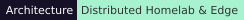
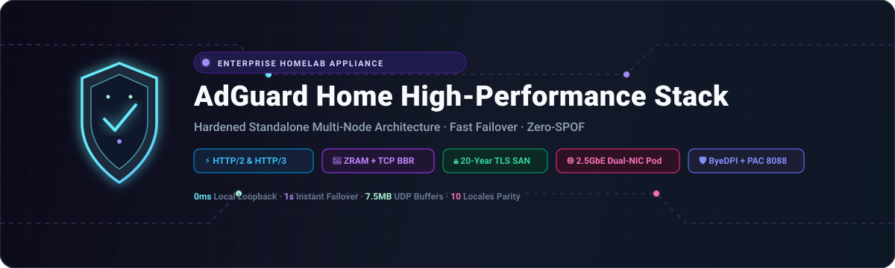
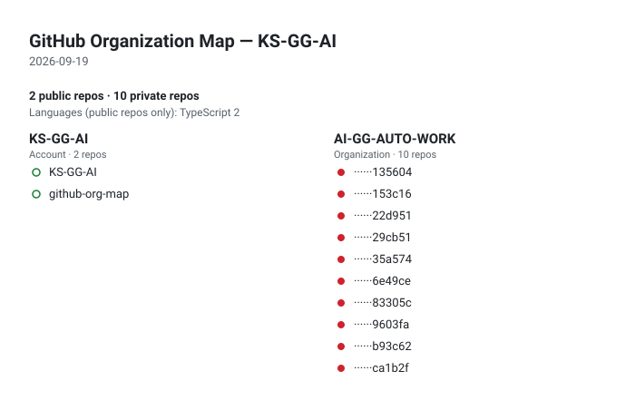

  <picture>
    <source media="(max-width: 840px)" srcset="../../assets/locales/ar/identity/hero-compact.svg" />
    
  </picture>
  <picture>
    
  </picture>

  <strong>أحوّل الأفكار إلى واقع بالبرمجة والفضول والعناية.</strong> 
  واجهات واضحة · تدفقات عمل مترابطة · أنظمة موثوقة

  <a href="../../../README.md">🇺🇸 English</a> ·
  <a href="./ko.md">🇰🇷 한국어</a> ·
  <a href="./zh-CN.md">🇨🇳 中文</a> ·
  <a href="./es.md">🇪🇸 Español</a> ·
  <a href="./hi.md">🇮🇳 हिन्दी</a> 
  <strong>🇸🇦 العربية</strong> ·
  <a href="./pt-BR.md">🇧🇷 Português</a> ·
  <a href="./ru.md">🇷🇺 Русский</a> ·
  <a href="./fr.md">🇫🇷 Français</a> ·
  <a href="./id.md">🇮🇩 Bahasa Indonesia</a>

  
  
  
  

---

<h2 style="display:inline-block; margin:0;">💡 نبذة عني</h2>

أحوّل الأفكار المبكرة إلى واجهات منتجات مفيدة وأدوات مترابطة وتدفقات عمل تظل سهلة الفهم مع نموها.

  <picture>
    
  </picture>

### ما أبنيه

- **تجارب المنتج** — واجهات وتدفقات تجعل الخطوة التالية واضحة
- **عمل مترابط** — واجهات API وتكاملات وأتمتة تقلل عمليات التسليم المتكررة
- **أسس قابلة للتطور** — أسس صغيرة يسهل اختبارها وتغييرها وصيانتها

### طريقة العمل

- **الوضوح أولاً** — اجعل الخطوة التالية واضحة.
- **ابقَ فضوليًا** — اترك مجالًا لاكتشاف طرق أفضل.
- **واصل التحسين** — دع التحسينات الصغيرة تتراكم.

مفيد. واضح. أفضل باستمرار.

---

<h2 style="display:inline-block; margin:0;">🚀 أبرز المشاريع والحلول</h2>

يبقى العمل العلني سهل الاستكشاف، بينما يُخفى العمل الخاص عمدًا. في خريطة المؤسسة تظهر المستودعات الخاصة كتسميات مخفية فقط، وتتحدث خرائط الطريق من بيانات المسائل العلنية فقط.

### الأنظمة والحلول المميزة

<table>
  <tr>
    <td width="50%" valign="top">
      
      <h4>🛡️ <a href="https://github.com/KS-GG-AI/adguardhome-homelab-stack">adguardhome-homelab-stack</a></h4>
      
<em>بيئة تشغيل AdGuard Home عالية الأداء ومحصنة للإنتاج مع تبديل ZRAM المضغوط، وTCP BBR، وHTTP/2 وHTTP/3 (QUIC/DoQ)، وعزل مستقل متعدد العقد.</em>

      

        
        
        
      

      <ul>
        <li><strong>⚡ ضبط الأداء</strong>: ذاكرة تبديل ZRAM (zstd) بسعة 1 جيجابايت (swappiness 180, page-cluster 0) + مخازن مؤقتة لـ UDP بسعة 7.5 ميجابايت</li>
        <li><strong>🔒 بروتوكولات متطورة</strong>: واجهة مستخدم ويب عبر HTTP/2 على المنفذ 443 + بروتوكولات DNS-over-QUIC (DoQ) وDoT على المنفذ 853 مع شهادة SAN لمدة 20 عاماً</li>
        <li><strong>🏛️ عزل بدون توقف</strong>: تشغيل مستقل Zero-SPOF بدون تبعيات مع تحويل فشل DNS فوري خلال ثانية واحدة</li>
        <li><strong>🌐 توجيه ذكي</strong>: دمج بروكسي ByeDPI SOCKS5 وخادم Python PAC لتجاوز الحجب الانتقائي</li>
        <li><strong>🌍 دعم متعدد اللغات</strong>: توثيق شامل بـ 10 لغات (<a href="https://github.com/KS-GG-AI/adguardhome-homelab-stack/blob/main/locales/ar.md">الوثائق العربية</a>، 한국어، English، إلخ)</li>
      </ul>
    </td>
    <td width="50%" valign="top">
      
      <h4>🗺️ <a href="https://github.com/KS-GG-AI/github-org-map-public">github-org-map-public</a></h4>
      
<em>خريطة طبولوجية آلية لمساحات العمل والمستودعات لحسابات ومنظمات GitHub مع حماية خصوصية المستودعات الخاصة.</em>

      

        
        
        
      

      <ul>
        <li><strong>🔄 أتمتة يومية</strong>: سير عمل GitHub Actions مجدول يومياً بدون أي تسريب للرموز السرية</li>
        <li><strong>🛡️ حماية الخصوصية</strong>: إخفاء معرفات المستودعات الخاصة مع الحفاظ على وضوح البنية المعمارية العامة</li>
        <li><strong>🎨 تمثيل مرئي تفاعلي</strong>: توليد مخططات SVG ديناميكية وصور GIF متحركة لكافة الحسابات</li>
      </ul>
    </td>
  </tr>
</table>

[تصفح المستودعات العامة](https://github.com/KS-GG-AI?tab=repositories) · [تصفح المسائل العلنية المتتبعة](https://github.com/issues?q=user%3AKS-GG-AI+is%3Aissue+is%3Aopen)

---

<h2 style="display:inline-block; margin:0;">⚡ المكدس التقني</h2>

مجموعة أدوات عملية، مجمعة وفق المهمة التي تساعد على إنجازها لا بوصفها قائمة تحقق.

- **الأساس** — TypeScript، JavaScript، Python، Go
- **تجارب المنتج** — React، Next.js، Vite، Tailwind CSS، Figma
- **أنظمة مترابطة** — Node.js، REST API، PostgreSQL، MCP
- **التسليم والموثوقية** — Git، Docker، GitHub Actions، منصات سحابية

<strong>استكشاف المكدس المرئي</strong>

 

<strong>الأدوات الأساسية</strong>

<picture>
  <source media="(max-width: 840px)" srcset="../../assets/locales/ar/visuals/toolbox-compact.svg" />
  
</picture>

<strong>الخريطة التقنية</strong>

<picture>
  <source media="(max-width: 840px)" srcset="../../assets/locales/ar/visuals/technology-stack-compact.svg" />
  
</picture>

<strong>نسخة متحركة</strong>

<picture>
  <source media="(max-width: 840px)" srcset="../../assets/locales/ar/motion/technology-stack-compact.gif" />
  
</picture>

- **اللغات والترميز** — TypeScript, JavaScript, Python, Go, Java, C#, C++, C, PHP, Rust, Bash, HTML, CSS, SQL
- **الخدمات والبيانات والأتمتة** — Node.js, Express, FastAPI, Flask, Django, GraphQL, PostgreSQL, MySQL, MongoDB, Redis, Prisma, LLMs, MCP, الأتمتة
- **الواجهات والمنتج** — React, Next.js, Vite, Tailwind CSS, Figma, Vercel
- **التسليم والعمليات** — Docker, Kubernetes, AWS, Google Cloud, Azure, Cloudflare, Nginx, Linux, GitHub Actions, Terraform, Git, GitLab, Ansible, Ubuntu

---

<h2 style="display:inline-block; margin:0;">🗺️ استكشاف المشاريع وخرائط الطريق</h2>

 

<strong>خريطة المؤسسة</strong>

  <a href="https://github.com/KS-GG-AI/github-org-map-public">
    <picture>
      
    </picture>
  </a>

تظهر المستودعات الخاصة فقط كتسميات مخفية.

<strong>خارطة طريق المشروع</strong>

<a href="https://github.com/issues?q=user%3AKS-GG-AI+is%3Aissue+is%3Aopen">
    <picture>
  
</picture>
  </a>

<strong>خارطة طريق التطوير</strong>

<a href="https://github.com/issues?q=user%3AKS-GG-AI+is%3Aissue">
    <picture>
  
</picture>
  </a>

يستخدم مسائل GitHub العامة فقط. أضف تسمية <code>roadmap:*</code> وتسمية <code>stage:*</code> إلى مسألة عامة لإظهارها.

---

## التواصل

للعمل العلني أو الملاحظات أو الاطلاع الأقرب على التنفيذ، هذه أوضح نقاط البداية.

[ملف GitHub](https://github.com/KS-GG-AI) · [المستودعات العامة](https://github.com/KS-GG-AI?tab=repositories) · [فتح مسألة](https://github.com/KS-GG-AI/KS-GG-AI/issues/new) · [مصدر الملف الشخصي](https://github.com/KS-GG-AI/KS-GG-AI)

