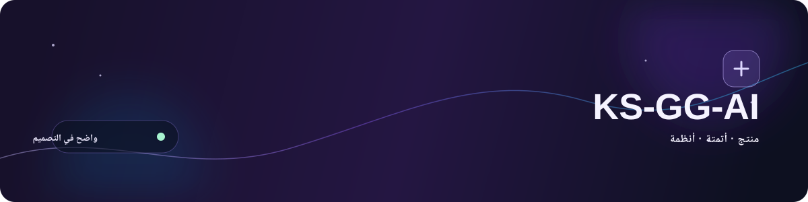
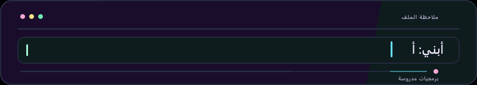
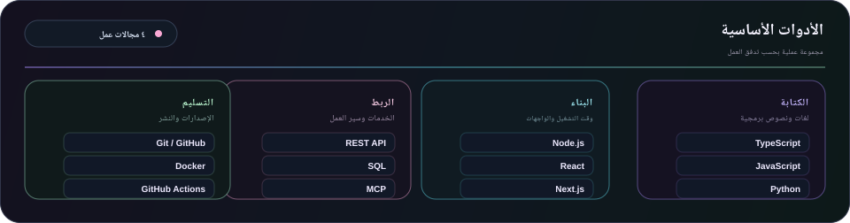
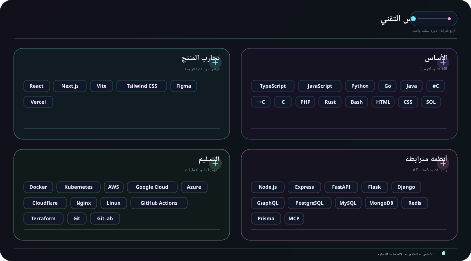
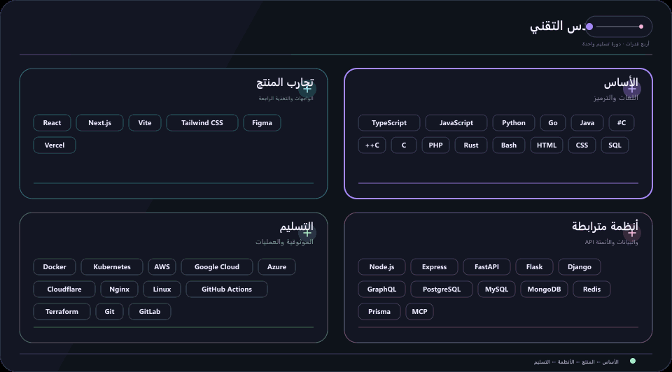

  
  

  <strong>أحوّل الأفكار إلى واقع بالبرمجة والفضول والعناية.</strong> 
  واجهات واضحة · تدفقات عمل مترابطة · أنظمة موثوقة

  <a href="../../../README.md">🇺🇸 English</a> ·
  <a href="./ko.md">🇰🇷 한국어</a> ·
  <a href="./zh-CN.md">🇨🇳 中文</a> ·
  <a href="./es.md">🇪🇸 Español</a> ·
  <a href="./hi.md">🇮🇳 हिन्दी</a> 
  <strong>🇸🇦 العربية</strong> ·
  <a href="./pt-BR.md">🇧🇷 Português</a> ·
  <a href="./ru.md">🇷🇺 Русский</a> ·
  <a href="./fr.md">🇫🇷 Français</a> ·
  <a href="./id.md">🇮🇩 Bahasa Indonesia</a>

## نبذة

أحوّل الأفكار المبكرة إلى واجهات منتجات مفيدة وأدوات مترابطة وتدفقات عمل تظل سهلة الفهم مع نموها.

  

### ما أبنيه

- **تجارب المنتج** — واجهات وتدفقات تجعل الخطوة التالية واضحة
- **عمل مترابط** — واجهات API وتكاملات وأتمتة تقلل عمليات التسليم المتكررة
- **أسس قابلة للتطور** — أسس صغيرة يسهل اختبارها وتغييرها وصيانتها

### طريقة العمل

- **الوضوح أولاً** — اجعل الخطوة التالية واضحة.
- **ابقَ فضوليًا** — اترك مجالًا لاكتشاف طرق أفضل.
- **واصل التحسين** — دع التحسينات الصغيرة تتراكم.

مفيد. واضح. أفضل باستمرار.

## التقنيات

مجموعة أدوات عملية، مجمعة وفق المهمة التي تساعد على إنجازها لا بوصفها قائمة تحقق.

- **الأساس** — TypeScript، JavaScript، Python، Go
- **تجارب المنتج** — React، Next.js، Vite، Tailwind CSS، Figma
- **أنظمة مترابطة** — Node.js، REST API، PostgreSQL، MCP
- **التسليم والموثوقية** — Git، Docker، GitHub Actions، منصات سحابية

<strong>استكشاف المكدس المرئي</strong>

 

<strong>الأدوات الأساسية</strong>

<strong>الخريطة التقنية</strong>

<strong>نسخة متحركة</strong>

- **اللغات والترميز** — TypeScript, JavaScript, Python, Go, Java, C#, C++, C, PHP, Rust, Bash, HTML, CSS, SQL
- **الخدمات والبيانات والأتمتة** — Node.js, Express, FastAPI, Flask, Django, GraphQL, PostgreSQL, MySQL, MongoDB, Redis, Prisma, LLMs, MCP, الأتمتة
- **الواجهات والمنتج** — React, Next.js, Vite, Tailwind CSS, Figma, Vercel
- **التسليم والعمليات** — Docker, Kubernetes, AWS, Google Cloud, Azure, Cloudflare, Nginx, Linux, GitHub Actions, Terraform, Git, GitLab, Ansible, Ubuntu

## المشاريع

يبقى العمل العلني سهل الاستكشاف، بينما يُخفى العمل الخاص عمدًا. تتحدث الخرائط التالية من بيانات المستودعات والمسائل العلنية فقط.

[تصفح المستودعات العامة](https://github.com/KS-GG-AI?tab=repositories) · [تصفح المسائل العلنية المتتبعة](https://github.com/issues?q=user%3AKS-GG-AI+is%3Aissue+is%3Aopen)

<strong>استكشاف المشاريع وخرائط الطريق</strong>

 

<strong>خريطة المشاريع</strong>

بيانات وصفية علنية فقط. لا تظهر الأسماء والبيانات الوصفية الخاصة مطلقاً.

<strong>خارطة طريق المشروع</strong>

<strong>خارطة طريق التطوير</strong>

يستخدم مسائل GitHub العامة فقط. أضف تسمية <code>roadmap:*</code> وتسمية <code>stage:*</code> إلى مسألة عامة لإظهارها.

## التواصل

للعمل العلني أو الملاحظات أو الاطلاع الأقرب على التنفيذ، هذه أوضح نقاط البداية.

[ملف GitHub](https://github.com/KS-GG-AI) · [المستودعات العامة](https://github.com/KS-GG-AI?tab=repositories) · [فتح مسألة](https://github.com/KS-GG-AI/KS-GG-AI/issues/new) · [مصدر الملف الشخصي](https://github.com/KS-GG-AI/KS-GG-AI)

