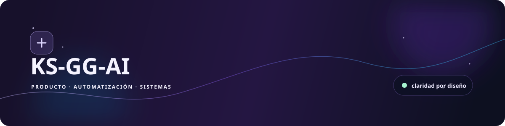
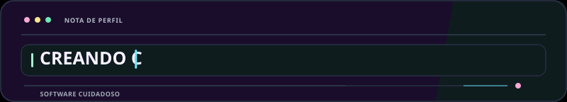
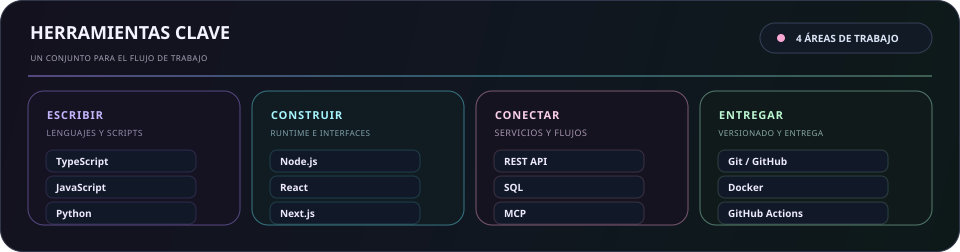
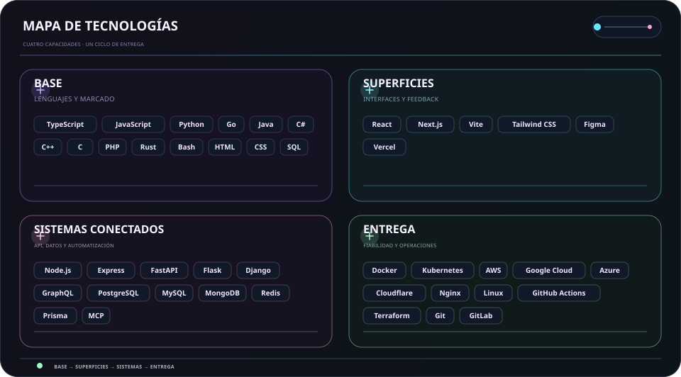
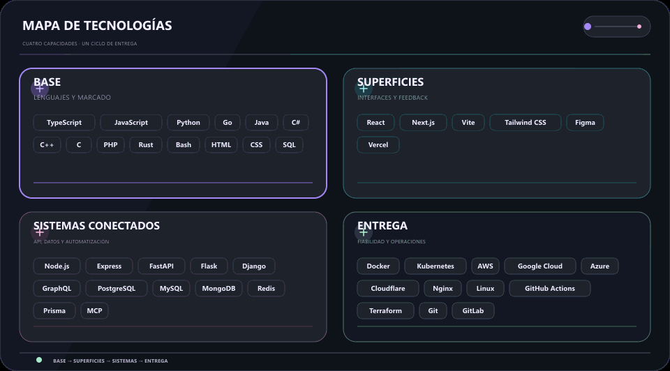

  <picture>
    <source media="(max-width: 840px)" srcset="../../assets/locales/es/identity/hero-compact.svg" />
    
  </picture>
  <picture>
    
  </picture>

  <strong>Convierto ideas en realidad con código, curiosidad y cuidado.</strong> 
  Interfaces claras · flujos conectados · sistemas fiables.

  <a href="../../../README.md">🇺🇸 English</a> ·
  <a href="./ko.md">🇰🇷 한국어</a> ·
  <a href="./zh-CN.md">🇨🇳 中文</a> ·
  <strong>🇪🇸 Español</strong> ·
  <a href="./hi.md">🇮🇳 हिन्दी</a> 
  <a href="./ar.md">🇸🇦 العربية</a> ·
  <a href="./pt-BR.md">🇧🇷 Português</a> ·
  <a href="./ru.md">🇷🇺 Русский</a> ·
  <a href="./fr.md">🇫🇷 Français</a> ·
  <a href="./id.md">🇮🇩 Bahasa Indonesia</a>

## Sobre mí

Convierto ideas tempranas en superficies de producto útiles, herramientas conectadas y flujos de trabajo que siguen siendo comprensibles al crecer.

  <picture>
    
  </picture>

### Lo que construyo

- **Experiencias de producto** — Interfaces y flujos que hacen evidente el siguiente paso
- **Trabajo conectado** — API, integraciones y automatización que reducen traspasos rutinarios
- **Hecho para evolucionar** — Bases pequeñas y fáciles de probar, cambiar y mantener

### Cómo trabajo

- **Claridad primero** — Hacer evidente el siguiente paso.
- **Mantener la curiosidad** — Dejar espacio para descubrir mejores formas.
- **Seguir mejorando** — Dejar que las pequeñas iteraciones se acumulen.

Útil. Claro. Cada vez mejor.

## Stack

Un conjunto práctico, agrupado por el trabajo que ayuda a resolver y no como una lista de control.

- **Base** — TypeScript, JavaScript, Python, Go
- **Superficies de producto** — React, Next.js, Vite, Tailwind CSS, Figma
- **Sistemas conectados** — Node.js, REST API, PostgreSQL, MCP
- **Entrega y fiabilidad** — Git, Docker, GitHub Actions, plataformas cloud

<strong>Explorar el stack visual</strong>

 

<strong>Herramientas principales</strong>

<picture>
  <source media="(max-width: 840px)" srcset="../../assets/locales/es/visuals/toolbox-compact.svg" />
  
</picture>

<strong>Mapa técnico</strong>

<picture>
  <source media="(max-width: 840px)" srcset="../../assets/locales/es/visuals/technology-stack-compact.svg" />
  
</picture>

<strong>En movimiento</strong>

<picture>
  <source media="(max-width: 840px)" srcset="../../assets/locales/es/motion/technology-stack-compact.gif" />
  
</picture>

- **Lenguajes y marcado** — TypeScript, JavaScript, Python, Go, Java, C#, C++, C, PHP, Rust, Bash, HTML, CSS, SQL
- **Servicios, datos y automatización** — Node.js, Express, FastAPI, Flask, Django, GraphQL, PostgreSQL, MySQL, MongoDB, Redis, Prisma, LLMs, MCP, automatización
- **Interfaces y producto** — React, Next.js, Vite, Tailwind CSS, Figma, Vercel
- **Entrega y operaciones** — Docker, Kubernetes, AWS, Google Cloud, Azure, Cloudflare, Nginx, Linux, GitHub Actions, Terraform, Git, GitLab, Ansible, Ubuntu

## Proyectos

El trabajo público se mantiene fácil de explorar; el trabajo privado se oculta intencionalmente. Los mapas siguientes se actualizan solo con repositorios e issues públicos.

[Ver repositorios públicos](https://github.com/KS-GG-AI?tab=repositories) · [Ver issues públicos seguidos](https://github.com/issues?q=user%3AKS-GG-AI+is%3Aissue+is%3Aopen)

<strong>Explorar proyectos y hojas de ruta</strong>

 

<strong>Mapa de proyectos</strong>

<picture>
  
</picture>

Solo metadatos públicos. Los nombres y metadatos privados nunca se muestran.

<strong>Hoja de ruta del proyecto</strong>

<picture>
  
</picture>

<strong>Hoja de ruta de desarrollo</strong>

<picture>
  
</picture>

Solo usa issues públicos de GitHub. Añade una etiqueta <code>roadmap:*</code> y una <code>stage:*</code> a un issue público para mostrarlo.

## Contacto

Para trabajo público, comentarios o una mirada más cercana a la implementación, estos son los puntos de partida más claros.

[Perfil de GitHub](https://github.com/KS-GG-AI) · [Repositorios públicos](https://github.com/KS-GG-AI?tab=repositories) · [Abrir un issue](https://github.com/KS-GG-AI/KS-GG-AI/issues/new) · [Código del perfil](https://github.com/KS-GG-AI/KS-GG-AI)
