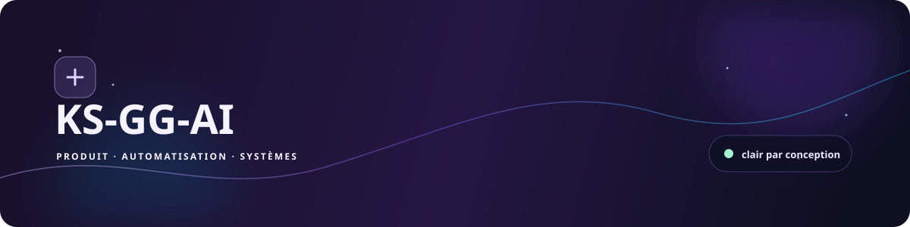
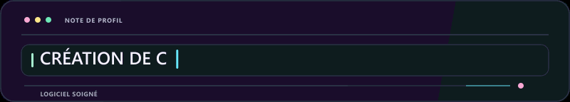
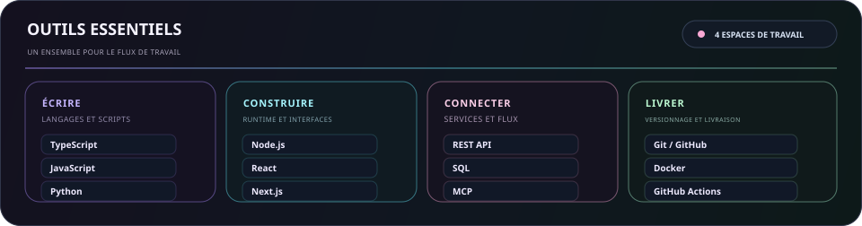
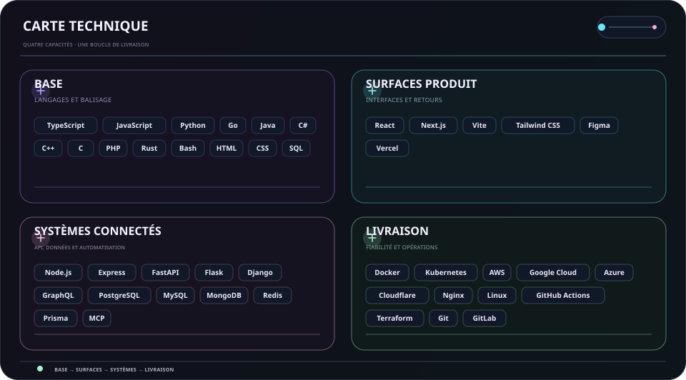
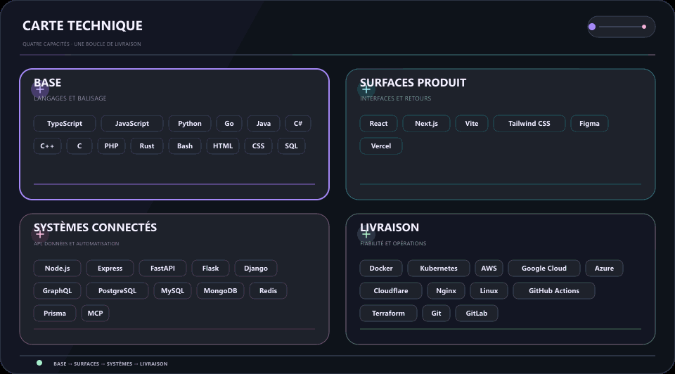

  
  

  <strong>Je transforme les idées en réalité avec du code, de la curiosité et du soin.</strong> 
  Interfaces claires · flux connectés · systèmes fiables.

  <a href="../../../README.md">🇺🇸 English</a> ·
  <a href="./ko.md">🇰🇷 한국어</a> ·
  <a href="./zh-CN.md">🇨🇳 中文</a> ·
  <a href="./es.md">🇪🇸 Español</a> ·
  <a href="./hi.md">🇮🇳 हिन्दी</a> 
  <a href="./ar.md">🇸🇦 العربية</a> ·
  <a href="./pt-BR.md">🇧🇷 Português</a> ·
  <a href="./ru.md">🇷🇺 Русский</a> ·
  <strong>🇫🇷 Français</strong> ·
  <a href="./id.md">🇮🇩 Bahasa Indonesia</a>

## À propos

Je transforme les premières idées en surfaces produit utiles, outils connectés et flux de travail qui restent faciles à comprendre à mesure qu'ils évoluent.

  

### Ce que je construis

- **Expériences produit** — Interfaces et parcours qui rendent la prochaine action évidente
- **Travail connecté** — API, intégrations et automatisation qui réduisent les transmissions répétitives
- **Conçu pour évoluer** — De petites fondations faciles à tester, modifier et maintenir

### Ma façon de travailler

- **La clarté d’abord** — Rendre la prochaine étape évidente.
- **Rester curieux** — Laisser de la place pour découvrir de meilleures approches.
- **Continuer à améliorer** — Laisser les petites itérations s’accumuler.

Utile. Clair. Toujours mieux.

## Stack

Un ensemble pratique, regroupé par le travail qu'il aide à accomplir plutôt que comme une checklist.

- **Base** — TypeScript, JavaScript, Python, Go
- **Surfaces produit** — React, Next.js, Vite, Tailwind CSS, Figma
- **Systèmes connectés** — Node.js, REST API, PostgreSQL, MCP
- **Livraison et fiabilité** — Git, Docker, GitHub Actions, plateformes cloud

<strong>Explorer le stack visuel</strong>

 

<strong>Outils essentiels</strong>

<strong>Carte technique</strong>

<strong>En mouvement</strong>

- **Langages et balisage** — TypeScript, JavaScript, Python, Go, Java, C#, C++, C, PHP, Rust, Bash, HTML, CSS, SQL
- **Services, données et automatisation** — Node.js, Express, FastAPI, Flask, Django, GraphQL, PostgreSQL, MySQL, MongoDB, Redis, Prisma, LLMs, MCP, automatisation
- **Interfaces et produit** — React, Next.js, Vite, Tailwind CSS, Figma, Vercel
- **Livraison et opérations** — Docker, Kubernetes, AWS, Google Cloud, Azure, Cloudflare, Nginx, Linux, GitHub Actions, Terraform, Git, GitLab, Ansible, Ubuntu

## Projets

Le travail public reste facile à explorer ; le travail privé est volontairement masqué. Les cartes ci-dessous sont mises à jour uniquement à partir de dépôts et d'issues publics.

[Voir les dépôts publics](https://github.com/KS-GG-AI?tab=repositories) · [Parcourir les issues publiques suivies](https://github.com/issues?q=user%3AKS-GG-AI+is%3Aissue+is%3Aopen)

<strong>Explorer les projets et feuilles de route</strong>

 

<strong>Carte des projets</strong>

Uniquement des métadonnées publiques. Les noms et métadonnées privés ne sont jamais affichés.

<strong>Feuille de route du projet</strong>

<strong>Feuille de route de développement</strong>

Utilise uniquement des issues GitHub publiques. Ajoutez un label <code>roadmap:*</code> et un label <code>stage:*</code> à une issue publique pour l'afficher.

## Contact

Pour le travail public, les retours ou un regard plus proche sur l'implémentation, ce sont les points de départ les plus clairs.

[Profil GitHub](https://github.com/KS-GG-AI) · [Dépôts publics](https://github.com/KS-GG-AI?tab=repositories) · [Ouvrir une issue](https://github.com/KS-GG-AI/KS-GG-AI/issues/new) · [Source du profil](https://github.com/KS-GG-AI/KS-GG-AI)
