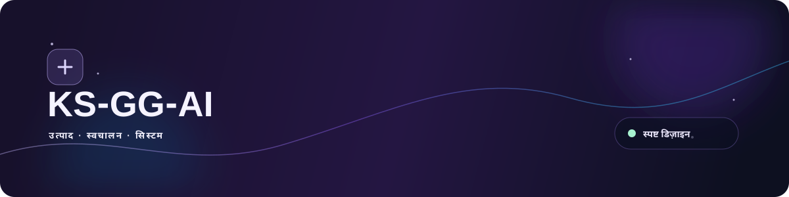
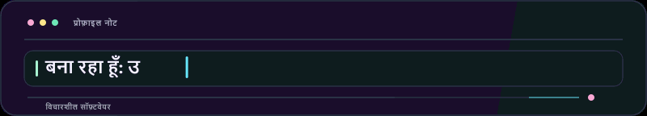
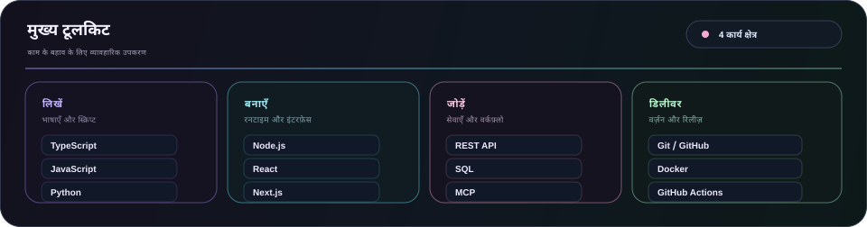
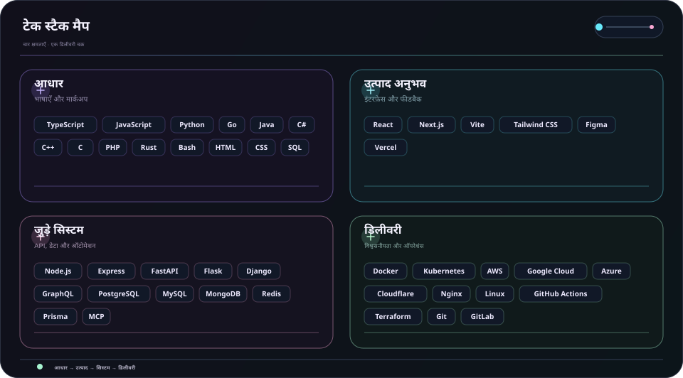
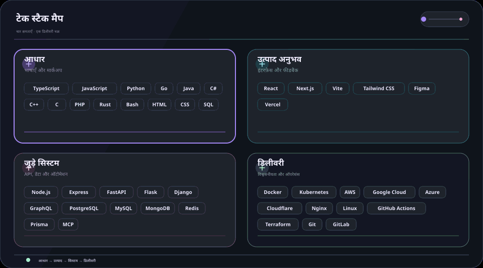

  <picture>
    <source media="(max-width: 840px)" srcset="../../assets/locales/hi/identity/hero-compact.svg" />
    
  </picture>
  <picture>
    
  </picture>

  <strong>कोड, जिज्ञासा और सावधानी से विचारों को आकार देता हूँ।</strong> 
  स्पष्ट इंटरफ़ेस · जुड़े हुए वर्कफ़्लो · भरोसेमंद सिस्टम

  <a href="../../../README.md">🇺🇸 English</a> ·
  <a href="./ko.md">🇰🇷 한국어</a> ·
  <a href="./zh-CN.md">🇨🇳 中文</a> ·
  <a href="./es.md">🇪🇸 Español</a> ·
  <strong>🇮🇳 हिन्दी</strong> 
  <a href="./ar.md">🇸🇦 العربية</a> ·
  <a href="./pt-BR.md">🇧🇷 Português</a> ·
  <a href="./ru.md">🇷🇺 Русский</a> ·
  <a href="./fr.md">🇫🇷 Français</a> ·
  <a href="./id.md">🇮🇩 Bahasa Indonesia</a>

  
  
  
  

---

<h2 style="display:inline-block; margin:0;">💡 परिचय</h2>

शुरुआती विचारों को उपयोगी प्रोडक्ट सतहों, जुड़े हुए टूल और ऐसे वर्कफ़्लो में बदलता हूँ जो बढ़ने पर भी समझने में आसान रहें।

  <picture>
    
  </picture>

### मैं क्या बनाता हूँ

- **प्रोडक्ट अनुभव** — ऐसे इंटरफ़ेस और फ्लो जिनमें अगला कदम तुरंत दिखे
- **जुड़ा हुआ काम** — API, इंटीग्रेशन और ऑटोमेशन जो रोज़मर्रा के हैंड-ऑफ कम करें
- **बदलाव के लिए तैयार** — छोटे आधार जिन्हें टेस्ट, बदलना और बनाए रखना आसान हो

### मैं कैसे काम करता हूँ

- **स्पष्टता पहले** — अगले कदम को स्पष्ट रखें।
- **जिज्ञासु रहें** — बेहतर तरीके खोजने की जगह बनाए रखें।
- **सुधार जारी रखें** — छोटे बदलावों को लगातार जोड़ें।

उपयोगी। स्पष्ट। लगातार बेहतर।

---

<h2 style="display:inline-block; margin:0;">🚀 प्रमुख परियोजनाएँ और समाधान</h2>

सार्वजनिक काम को आसानी से देखा जा सकता है; निजी काम जानबूझकर छिपा रहता है। संगठन मैप में निजी रिपॉज़िटरी केवल छिपाए गए लेबल के रूप में दिखती हैं, और रोडमैप केवल सार्वजनिक Issue डेटा से अपडेट होते हैं।

### प्रमुख सिस्टम और समाधान

<table>
  <tr>
    <td width="50%" valign="top">
      

        
        
      

      <h4>🛡️ <a href="https://github.com/KS-GG-AI/adguardhome-homelab-stack">adguardhome-homelab-stack</a></h4>
      
<em>ZRAM कंप्रेस्ड स्वैप, TCP BBR, HTTP/2 और HTTP/3 (QUIC/DoQ), और मल्टी-नोड स्टैंडअलोन रेजिलिएंस के साथ प्रोडक्शन-ग्रेड AdGuard Home स्टैक।</em>

      

        
        
        
      

      <ul>
        <li><strong>⚡ प्रदर्शन ट्यूनिंग</strong>: 1GB ZRAM (zstd) स्वैप (swappiness 180, page-cluster 0) + 7.5MB UDP सॉकेट बफ़र</li>
        <li><strong>🔒 आधुनिक प्रोटोकॉल</strong>: पोर्ट 443 पर HTTP/2 वेब UI + 20-वर्षीय SAN प्रमाणपत्र के साथ पोर्ट 853 पर DNS-over-QUIC (DoQ) और DoT</li>
        <li><strong>🏛️ निर्बाध अलगाव</strong>: 1-सेकंड त्वरित DNS फ़ेलओवर के साथ Zero-SPOF स्टैंडअलोन नोड आर्किटेक्चर</li>
        <li><strong>🌐 स्मार्ट रूटिंग</strong>: चुनिंदा डोमेन रूटिंग के लिए ByeDPI SOCKS5 प्रॉक्सी और Python PAC डेमन</li>
        <li><strong>🌍 बहुभाषी</strong>: 10 भाषाओं में पूर्ण दस्तावेज़ (<a href="https://github.com/KS-GG-AI/adguardhome-homelab-stack/blob/main/locales/hi.md">हिन्दी दस्तावेज़</a>, 한국어, English आदि)</li>
      </ul>
    </td>
    <td width="50%" valign="top">
      
      <h4>🗺️ <a href="https://github.com/KS-GG-AI/github-org-map-public">github-org-map-public</a></h4>
      
<em>GitHub खातों और संगठनों के लिए स्वचालित, गोपनीयता-संरक्षित कार्यक्षेत्र और रिपॉज़िटरी विज़ुअलाइज़ेशन मैप।</em>

      

        
        
        
      

      <ul>
        <li><strong>🔄 स्वचालित पाइपलाइन</strong>: बिना किसी टोकन लीक के दैनिक अनुसूचित GitHub Actions वर्कफ़्लो</li>
        <li><strong>🛡️ गोपनीयता सुरक्षा</strong>: समग्र आर्किटेक्चर प्रदर्शित करते हुए निजी रिपॉज़िटरी नाम सुरक्षित रूप से मास्क किए गए</li>
        <li><strong>🎨 गतिशील विज़ुअलाइज़ेशन</strong>: गतिशील SVG आरेख और एनिमेटेड GIF टोपोलॉजी जेनरेशन</li>
      </ul>
    </td>
  </tr>
</table>

[सार्वजनिक रिपॉज़िटरी देखें](https://github.com/KS-GG-AI?tab=repositories) · [सार्वजनिक ट्रैक किए गए Issue देखें](https://github.com/issues?q=user%3AKS-GG-AI+is%3Aissue+is%3Aopen)

---

<h2 style="display:inline-block; margin:0;">⚡ तकनीकी स्टैक</h2>

यह एक व्यावहारिक टूलसेट है, जिसे काम के आधार पर व्यवस्थित किया गया है, चेकलिस्ट की तरह नहीं।

- **आधार** — TypeScript, JavaScript, Python, Go
- **प्रोडक्ट अनुभव** — React, Next.js, Vite, Tailwind CSS, Figma
- **जुड़े सिस्टम** — Node.js, REST API, PostgreSQL, MCP
- **डिलीवरी और विश्वसनीयता** — Git, Docker, GitHub Actions, क्लाउड प्लेटफ़ॉर्म

<strong>विज़ुअल स्टैक देखें</strong>

 

<strong>मुख्य टूलसेट</strong>

<picture>
  <source media="(max-width: 840px)" srcset="../../assets/locales/hi/visuals/toolbox-compact.svg" />
  
</picture>

<strong>तकनीकी नक्शा</strong>

<picture>
  <source media="(max-width: 840px)" srcset="../../assets/locales/hi/visuals/technology-stack-compact.svg" />
  
</picture>

<strong>गतिशील रूप</strong>

<picture>
  <source media="(max-width: 840px)" srcset="../../assets/locales/hi/motion/technology-stack-compact.gif" />
  
</picture>

- **भाषाएँ और मार्कअप** — TypeScript, JavaScript, Python, Go, Java, C#, C++, C, PHP, Rust, Bash, HTML, CSS, SQL
- **सेवाएँ, डेटा और ऑटोमेशन** — Node.js, Express, FastAPI, Flask, Django, GraphQL, PostgreSQL, MySQL, MongoDB, Redis, Prisma, LLMs, MCP, ऑटोमेशन
- **इंटरफ़ेस और प्रोडक्ट** — React, Next.js, Vite, Tailwind CSS, Figma, Vercel
- **डिलीवरी और ऑपरेशंस** — Docker, Kubernetes, AWS, Google Cloud, Azure, Cloudflare, Nginx, Linux, GitHub Actions, Terraform, Git, GitLab, Ansible, Ubuntu

---

<h2 style="display:inline-block; margin:0;">🗺️ परियोजनाएँ और रोडमैप एक्सप्लोर करें</h2>

 

<strong>संगठन मैप</strong>

  <a href="https://github.com/KS-GG-AI/github-org-map-public">
    <picture>
      
    </picture>
  </a>

निजी रिपॉज़िटरी केवल छिपाए गए लेबल के रूप में दिखती हैं।

<strong>प्रोजेक्ट रोडमैप</strong>

<a href="https://github.com/issues?q=user%3AKS-GG-AI+is%3Aissue+is%3Aopen">
    <picture>
  
</picture>
  </a>

<strong>डेवलपमेंट रोडमैप</strong>

<a href="https://github.com/issues?q=user%3AKS-GG-AI+is%3Aissue">
    <picture>
  
</picture>
  </a>

केवल सार्वजनिक GitHub Issue का उपयोग होता है। किसी सार्वजनिक Issue को दिखाने के लिए एक <code>roadmap:*</code> और एक <code>stage:*</code> लेबल जोड़ें।

---

## संपर्क

सार्वजनिक काम, प्रतिक्रिया या कार्यान्वयन को करीब से देखने के लिए ये सबसे स्पष्ट शुरुआती स्थान हैं।

[GitHub प्रोफ़ाइल](https://github.com/KS-GG-AI) · [सार्वजनिक रिपॉज़िटरी](https://github.com/KS-GG-AI?tab=repositories) · [Issue खोलें](https://github.com/KS-GG-AI/KS-GG-AI/issues/new) · [प्रोफ़ाइल स्रोत](https://github.com/KS-GG-AI/KS-GG-AI)
