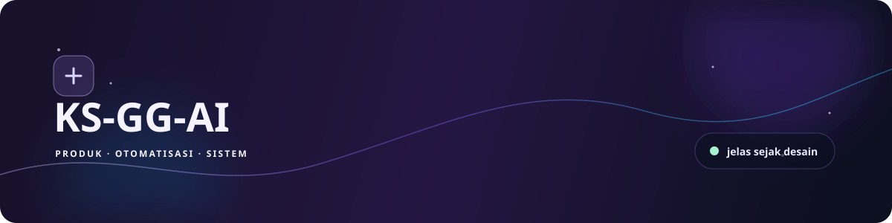
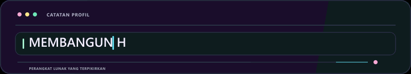
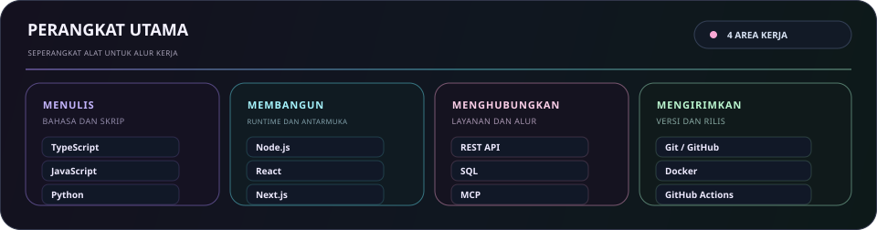
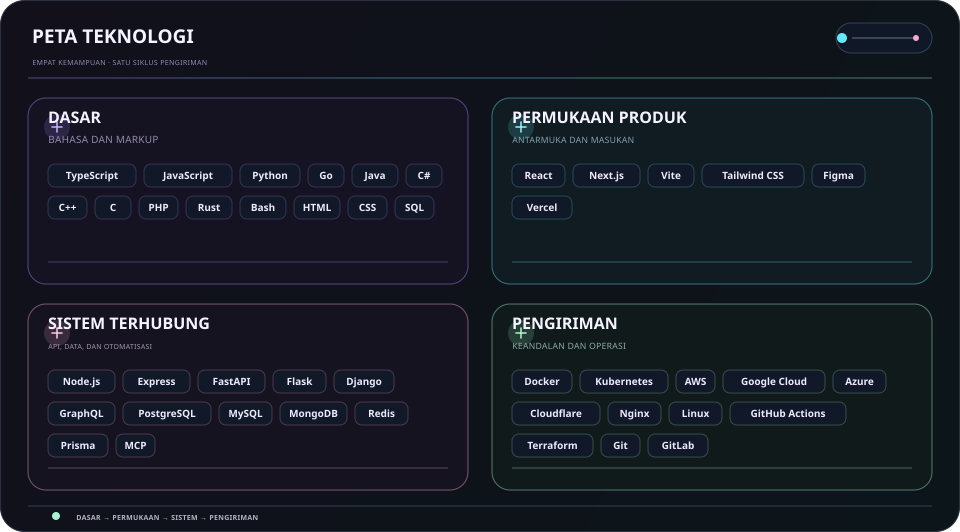
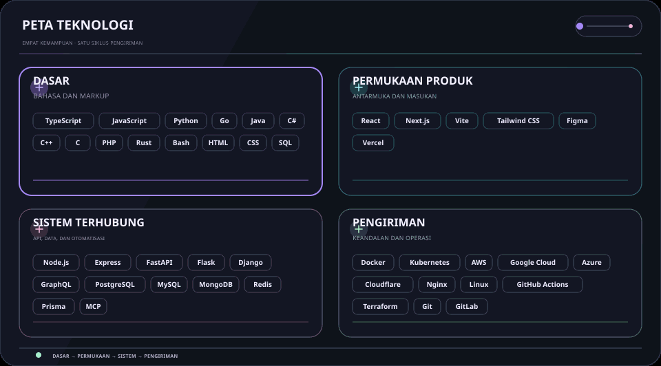

  <picture>
    <source media="(max-width: 840px)" srcset="../../assets/locales/id/identity/hero-compact.svg" />
    
  </picture>
  <picture>
    
  </picture>

  <strong>Mengubah ide menjadi kenyataan dengan kode, rasa ingin tahu, dan ketelitian.</strong> 
  Antarmuka jelas · alur kerja terhubung · sistem andal.

  <a href="../../../README.md">🇺🇸 English</a> ·
  <a href="./ko.md">🇰🇷 한국어</a> ·
  <a href="./zh-CN.md">🇨🇳 中文</a> ·
  <a href="./es.md">🇪🇸 Español</a> ·
  <a href="./hi.md">🇮🇳 हिन्दी</a> 
  <a href="./ar.md">🇸🇦 العربية</a> ·
  <a href="./pt-BR.md">🇧🇷 Português</a> ·
  <a href="./ru.md">🇷🇺 Русский</a> ·
  <a href="./fr.md">🇫🇷 Français</a> ·
  <strong>🇮🇩 Bahasa Indonesia</strong>

  
  
  
  

## Tentang

Mengubah ide awal menjadi permukaan produk yang berguna, alat yang terhubung, dan alur kerja yang tetap mudah dipahami saat berkembang.

  <picture>
    
  </picture>

### Yang saya bangun

- **Pengalaman produk** — Antarmuka dan alur yang membuat langkah berikutnya terlihat jelas
- **Kerja yang terhubung** — API, integrasi, dan otomatisasi yang mengurangi serah-terima rutin
- **Dibuat untuk berkembang** — Fondasi kecil yang mudah diuji, diubah, dan dipelihara

### Cara saya bekerja

- **Utamakan kejelasan** — Jadikan langkah berikutnya jelas.
- **Tetap ingin tahu** — Sisakan ruang untuk menemukan cara yang lebih baik.
- **Terus berkembang** — Biarkan iterasi kecil terus bertambah.

Berguna. Jelas. Terus menjadi lebih baik.

## Stack

Seperangkat alat praktis, dikelompokkan berdasarkan pekerjaan yang dibantu untuk diselesaikan, bukan sebagai daftar periksa.

- **Dasar** — TypeScript, JavaScript, Python, Go
- **Permukaan produk** — React, Next.js, Vite, Tailwind CSS, Figma
- **Sistem terhubung** — Node.js, REST API, PostgreSQL, MCP
- **Pengiriman dan keandalan** — Git, Docker, GitHub Actions, platform cloud

<strong>Jelajahi stack visual</strong>

 

<strong>Perangkat utama</strong>

<picture>
  <source media="(max-width: 840px)" srcset="../../assets/locales/id/visuals/toolbox-compact.svg" />
  
</picture>

<strong>Peta teknis</strong>

<picture>
  <source media="(max-width: 840px)" srcset="../../assets/locales/id/visuals/technology-stack-compact.svg" />
  
</picture>

<strong>Dalam gerak</strong>

<picture>
  <source media="(max-width: 840px)" srcset="../../assets/locales/id/motion/technology-stack-compact.gif" />
  
</picture>

- **Bahasa dan markup** — TypeScript, JavaScript, Python, Go, Java, C#, C++, C, PHP, Rust, Bash, HTML, CSS, SQL
- **Layanan, data, dan otomatisasi** — Node.js, Express, FastAPI, Flask, Django, GraphQL, PostgreSQL, MySQL, MongoDB, Redis, Prisma, LLMs, MCP, otomatisasi
- **Antarmuka dan produk** — React, Next.js, Vite, Tailwind CSS, Figma, Vercel
- **Pengiriman dan operasi** — Docker, Kubernetes, AWS, Google Cloud, Azure, Cloudflare, Nginx, Linux, GitHub Actions, Terraform, Git, GitLab, Ansible, Ubuntu

## Proyek

Karya publik tetap mudah dijelajahi; pekerjaan privat sengaja disembunyikan. Pada peta organisasi, repositori privat hanya tampil sebagai label yang disamarkan, dan roadmap diperbarui hanya dari issue publik.

### Sistem & Solusi Unggulan

<table>
  <tr>
    <td width="50%" valign="top">
      <h4>🛡️ <a href="https://github.com/KS-GG-AI/adguardhome-homelab-stack">adguardhome-homelab-stack</a></h4>
      
<em>Stack AdGuard Home yang diperkeras untuk produksi dengan swap terkompresi ZRAM, TCP BBR, HTTP/2 & HTTP/3 (QUIC/DoQ), dan ketahanan mandiri multi-node.</em>

      

        
        
        
      

      <ul>
        <li><strong>⚡ Kinerja</strong>: 1GB ZRAM (zstd) swap terkompresi (swappiness 180, page-cluster 0) + buffer soket UDP 7.5MB</li>
        <li><strong>🔒 Protokol Modern</strong>: UI Web HTTP/2 pada port 443 + DNS-over-QUIC (DoQ) & DoT pada port 853 dengan sertifikat SAN 20 tahun</li>
        <li><strong>🏛️ Ketahanan Mandiri</strong>: Isolasi multi-node Zero-SPOF dengan failover DNS instan 1 detik</li>
        <li><strong>🌐 Perutean Cerdas</strong>: Proksi ByeDPI SOCKS5 dan daemon Python PAC untuk bypass domain selektif</li>
        <li><strong>🌍 Multibahasa</strong>: Dokumentasi lengkap dalam 10 bahasa (<a href="https://github.com/KS-GG-AI/adguardhome-homelab-stack/blob/main/locales/id.md">Bahasa Indonesia</a>, 한국어, English, dll.)</li>
      </ul>
    </td>
    <td width="50%" valign="top">
      <h4>🗺️ <a href="https://github.com/KS-GG-AI/github-org-map-public">github-org-map-public</a></h4>
      
<em>Peta visual otomatis untuk ruang kerja dan repositori akun & organisasi GitHub dengan perlindungan privasi.</em>

      

        
        
        
      

      <ul>
        <li><strong>🔄 Otomatisasi Terjadwal</strong>: Alur kerja harian GitHub Actions tanpa risiko kebocoran token rahasia</li>
        <li><strong>🛡️ Privasi Terjaga</strong>: Menyamarkan repositori privat secara aman sambil menampilkan arsitektur publik</li>
        <li><strong>🎨 Visualisasi Dinamis</strong>: Pembuatan diagram vektor SVG dinamis dan animasi GIF topologi</li>
      </ul>
    </td>
  </tr>
</table>

[Lihat repositori publik](https://github.com/KS-GG-AI?tab=repositories) · [Lihat issue publik yang dilacak](https://github.com/issues?q=user%3AKS-GG-AI+is%3Aissue+is%3Aopen)

<strong>Jelajahi proyek dan peta jalan</strong>

 

<strong>Peta organisasi</strong>

  <a href="https://github.com/KS-GG-AI/github-org-map-public">
    <picture>
      
    </picture>
  </a>

Repositori privat hanya ditampilkan sebagai label yang disamarkan.

<strong>Peta jalan proyek</strong>

<picture>
  
</picture>

<strong>Peta jalan pengembangan</strong>

<picture>
  
</picture>

Hanya menggunakan issue GitHub publik. Tambahkan satu label <code>roadmap:*</code> dan satu <code>stage:*</code> pada issue publik agar tampil di sini.

## Kontak

Untuk karya publik, masukan, atau melihat implementasi lebih dekat, ini adalah titik awal yang paling jelas.

[Profil GitHub](https://github.com/KS-GG-AI) · [Repositori publik](https://github.com/KS-GG-AI?tab=repositories) · [Buka issue](https://github.com/KS-GG-AI/KS-GG-AI/issues/new) · [Sumber profil](https://github.com/KS-GG-AI/KS-GG-AI)
