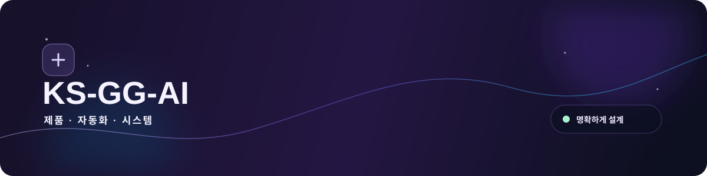
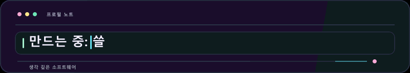
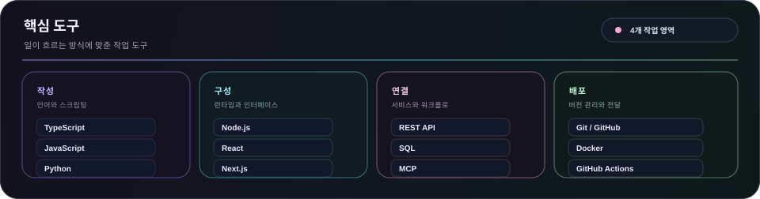
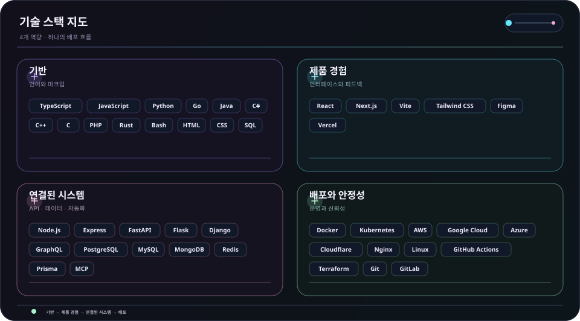
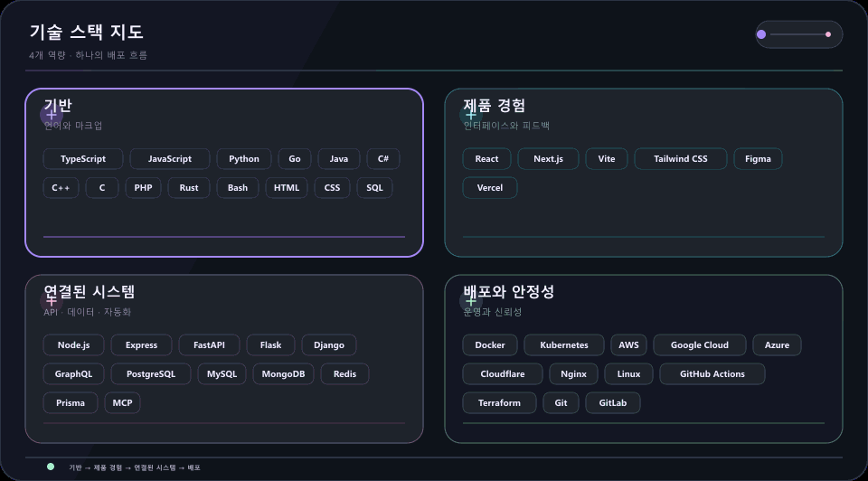

  <picture>
    <source media="(max-width: 840px)" srcset="../../assets/locales/ko/identity/hero-compact.svg" />
    
  </picture>
  <picture>
    
  </picture>

  <strong>코드, 호기심, 그리고 세심함으로 아이디어를 현실로 만듭니다.</strong> 
  명확한 인터페이스 · 연결된 워크플로 · 믿을 수 있는 시스템

  <a href="../../../README.md">🇺🇸 English</a> ·
  <strong>🇰🇷 한국어</strong> ·
  <a href="./zh-CN.md">🇨🇳 中文</a> ·
  <a href="./es.md">🇪🇸 Español</a> ·
  <a href="./hi.md">🇮🇳 हिन्दी</a> 
  <a href="./ar.md">🇸🇦 العربية</a> ·
  <a href="./pt-BR.md">🇧🇷 Português</a> ·
  <a href="./ru.md">🇷🇺 Русский</a> ·
  <a href="./fr.md">🇫🇷 Français</a> ·
  <a href="./id.md">🇮🇩 Bahasa Indonesia</a>

  
  
  
  

---

<h2 style="display:inline-block; margin:0;">💡 소개</h2>

초기 아이디어를 쓰기 쉬운 제품 화면, 자연스럽게 연결되는 도구, 성장해도 이해하기 쉬운 워크플로로 만듭니다.

  <picture>
    
  </picture>

### 만드는 것

- **제품 흐름** — 다음 행동이 자연스럽게 보이는 인터페이스와 흐름
- **연결된 작업** — 반복적인 전달을 줄이는 API, 연동, 자동화
- **변화를 견디는 기반** — 테스트, 수정, 유지보수가 쉬운 작은 기반

### 일하는 방식

- **명확성을 먼저** — 다음 행동이 자연스럽게 보이도록 만듭니다.
- **호기심 유지** — 더 나은 방법을 찾을 여지를 남깁니다.
- **계속 개선** — 작은 반복을 차분히 쌓습니다.

쓸모 있게. 명확하게. 계속 더 좋게.

---

<h2 style="display:inline-block; margin:0;">🚀 주요 프로젝트 및 솔루션</h2>

공개 작업은 쉽게 살펴볼 수 있게 두고, 비공개 작업은 의도적으로 숨깁니다. 조직 지도에서 비공개 저장소는 마스킹한 라벨로만 보이고, 로드맵은 공개 이슈만 바탕으로 갱신됩니다.

### 주요 시스템 및 솔루션

<table>
  <tr>
    <td width="50%" valign="top">
      
      <h4>🛡️ <a href="https://github.com/KS-GG-AI/adguardhome-homelab-stack">adguardhome-homelab-stack</a></h4>
      
<em>ZRAM 압축 스왑, TCP BBR, HTTP/2 및 HTTP/3(QUIC/DoQ), 단독 노드 무중단 격리를 적용한 고성능 AdGuard Home 프로덕션 스택.</em>

      

        
        
        
      

      <ul>
        <li><strong>⚡ 성능 최적화</strong>: 1GB ZRAM(zstd) 압축 스왑(swappiness 180, page-cluster 0) + 7.5MB 대용량 UDP 소켓 버퍼</li>
        <li><strong>🔒 차세대 프로토콜</strong>: 포트 443 HTTP/2 웹 UI + 포트 853 DNS-over-QUIC(DoQ)/DoT (2046년까지 유효한 20년 자체 SAN 인증서)</li>
        <li><strong>🏛️ 무중단 격리</strong>: 물리 노드 간 종속 없는 Zero-SPOF 단독 운영 및 게스트 1초 즉각 DNS 장애 폴백</li>
        <li><strong>🌐 스마트 라우팅</strong>: ByeDPI SOCKS5 프록시 및 경량 Python PAC 데몬 연동 선별 우회</li>
        <li><strong>🌍 다국어 지원</strong>: 10개 언어 전체 번역 문서 제공 (<a href="https://github.com/KS-GG-AI/adguardhome-homelab-stack/blob/main/locales/ko.md">한국어 설명서</a>, English 등)</li>
      </ul>
    </td>
    <td width="50%" valign="top">
      
      <h4>🗺️ <a href="https://github.com/KS-GG-AI/github-org-map-public">github-org-map-public</a></h4>
      
<em>GitHub 계정 및 조직의 작업 공간과 저장소 구조를 시각화하고 프라이버시를 안전하게 보호하는 자동 생성 맵.</em>

      

        
        
        
      

      <ul>
        <li><strong>🔄 무인 자동화</strong>: GitHub Actions 기반 매일 정기 스케줄 갱신 및 시크릿 유출 없는 격리 워크플로</li>
        <li><strong>🛡️ 프라이버시 보호</strong>: 비공개 저장소 식별자를 안전하게 마스킹 처리하여 전체 아키텍처만 공개</li>
        <li><strong>🎨 동적 시각화</strong>: 모든 조직 및 계정 단위 다이내믹 SVG 다이어그램 및 움직이는 애니메이션 GIF 생성</li>
      </ul>
    </td>
  </tr>
</table>

[공개 저장소 보기](https://github.com/KS-GG-AI?tab=repositories) · [공개 추적 이슈 보기](https://github.com/issues?q=user%3AKS-GG-AI+is%3Aissue+is%3Aopen)

---

<h2 style="display:inline-block; margin:0;">⚡ 기술 스택</h2>

체크리스트보다는 실제 문제를 해결하는 흐름을 기준으로 정리한 작업 도구입니다.

- **기반** — TypeScript, JavaScript, Python, Go
- **제품 경험** — React, Next.js, Vite, Tailwind CSS, Figma
- **연결된 시스템** — Node.js, REST API, PostgreSQL, MCP
- **배포와 안정성** — Git, Docker, GitHub Actions, 클라우드 플랫폼

<strong>시각 기술 스택 열기</strong>

 

<strong>핵심 도구</strong>

<picture>
  <source media="(max-width: 840px)" srcset="../../assets/locales/ko/visuals/toolbox-compact.svg" />
  
</picture>

<strong>기술 지도</strong>

<picture>
  <source media="(max-width: 840px)" srcset="../../assets/locales/ko/visuals/technology-stack-compact.svg" />
  
</picture>

<strong>움직이는 지도</strong>

<picture>
  <source media="(max-width: 840px)" srcset="../../assets/locales/ko/motion/technology-stack-compact.gif" />
  
</picture>

- **언어와 마크업** — TypeScript, JavaScript, Python, Go, Java, C#, C++, C, PHP, Rust, Bash, HTML, CSS, SQL
- **서비스·데이터·자동화** — Node.js, Express, FastAPI, Flask, Django, GraphQL, PostgreSQL, MySQL, MongoDB, Redis, Prisma, LLMs, MCP, 자동화
- **인터페이스와 프로덕트** — React, Next.js, Vite, Tailwind CSS, Figma, Vercel
- **배포와 운영** — Docker, Kubernetes, AWS, Google Cloud, Azure, Cloudflare, Nginx, Linux, GitHub Actions, Terraform, Git, GitLab, Ansible, Ubuntu

---

<h2 style="display:inline-block; margin:0;">🗺️ 프로젝트 및 로드맵 탐색</h2>

 

<strong>조직 지도</strong>

  <a href="https://github.com/KS-GG-AI/github-org-map-public">
    <picture>
      
    </picture>
  </a>

비공개 저장소는 마스킹한 라벨로만 표시됩니다.

<strong>프로젝트 로드맵</strong>

<a href="https://github.com/issues?q=user%3AKS-GG-AI+is%3Aissue+is%3Aopen">
    <picture>
  
</picture>
  </a>

<strong>개발 로드맵</strong>

<a href="https://github.com/issues?q=user%3AKS-GG-AI+is%3Aissue">
    <picture>
  
</picture>
  </a>

공개 GitHub 이슈만 사용합니다. 이슈가 보이게 하려면 <code>roadmap:*</code> 라벨 하나와 <code>stage:*</code> 라벨 하나를 붙이면 됩니다.

---

## 연락

공개 작업, 피드백, 구현 내용을 더 살펴보려면 아래 경로가 가장 빠릅니다.

[GitHub 프로필](https://github.com/KS-GG-AI) · [공개 저장소](https://github.com/KS-GG-AI?tab=repositories) · [이슈 열기](https://github.com/KS-GG-AI/KS-GG-AI/issues/new) · [프로필 소스](https://github.com/KS-GG-AI/KS-GG-AI)
