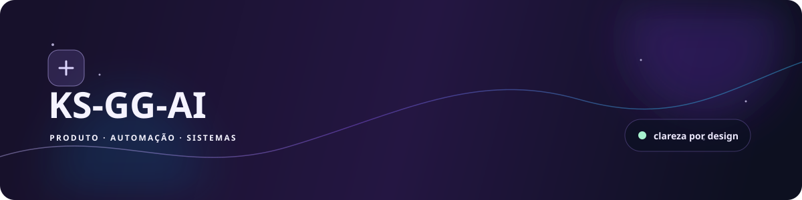
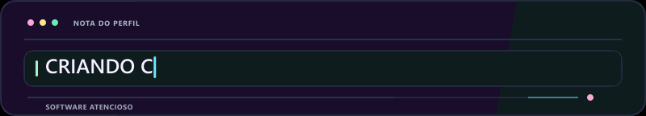
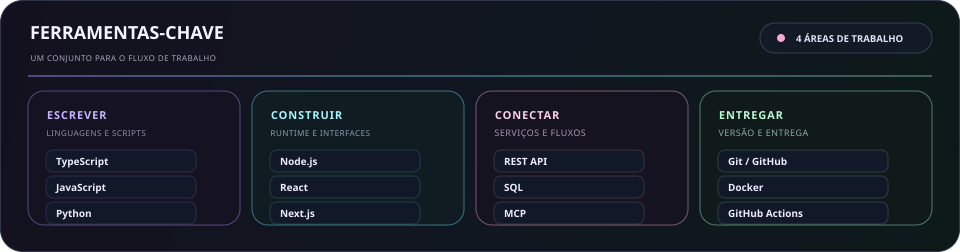
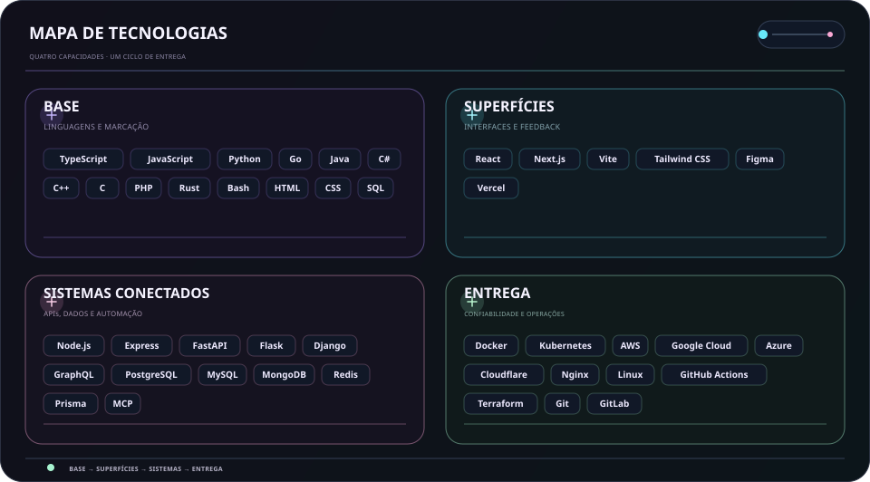
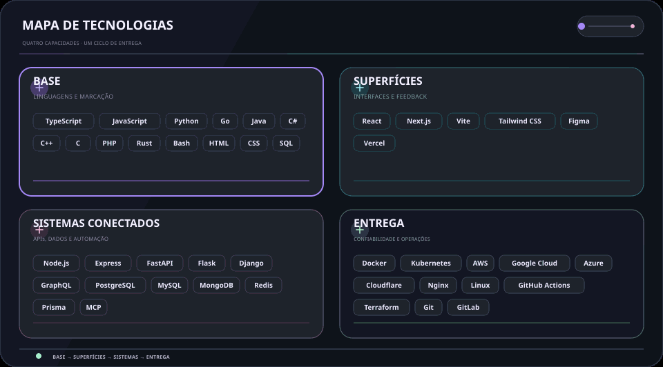

  <picture>
    <source media="(max-width: 840px)" srcset="../../assets/locales/pt-BR/identity/hero-compact.svg" />
    
  </picture>
  <picture>
    
  </picture>

  <strong>Transformo ideias em realidade com código, curiosidade e cuidado.</strong> 
  Interfaces claras · fluxos conectados · sistemas confiáveis.

  <a href="../../../README.md">🇺🇸 English</a> ·
  <a href="./ko.md">🇰🇷 한국어</a> ·
  <a href="./zh-CN.md">🇨🇳 中文</a> ·
  <a href="./es.md">🇪🇸 Español</a> ·
  <a href="./hi.md">🇮🇳 हिन्दी</a> 
  <a href="./ar.md">🇸🇦 العربية</a> ·
  <strong>🇧🇷 Português</strong> ·
  <a href="./ru.md">🇷🇺 Русский</a> ·
  <a href="./fr.md">🇫🇷 Français</a> ·
  <a href="./id.md">🇮🇩 Bahasa Indonesia</a>

  
  
  
  

---

<h2 style="display:inline-block; margin:0;">💡 Sobre mim</h2>

Transformo ideias iniciais em superfícies de produto úteis, ferramentas conectadas e fluxos de trabalho que continuam fáceis de entender enquanto crescem.

  <picture>
    
  </picture>

### O que construo

- **Experiências de produto** — Interfaces e fluxos que deixam claro o próximo passo
- **Trabalho conectado** — APIs, integrações e automação que reduzem repasses rotineiros
- **Feito para evoluir** — Bases pequenas e fáceis de testar, mudar e manter

### Como trabalho

- **Clareza primeiro** — Tornar o próximo passo evidente.
- **Manter a curiosidade** — Deixar espaço para descobrir caminhos melhores.
- **Continuar melhorando** — Deixar pequenas iterações se acumularem.

Útil. Claro. Sempre melhor.

---

<h2 style="display:inline-block; margin:0;">🚀 Projetos e Soluções</h2>

O trabalho público permanece fácil de explorar; o trabalho privado fica intencionalmente oculto. No mapa da organização, os repositórios privados aparecem apenas como rótulos mascarados, e os roadmaps são atualizados apenas a partir de issues públicos.

### Sistemas e Soluções em Destaque

<table>
  <tr>
    <td width="50%" valign="top">
      
      <h4>🛡️ <a href="https://github.com/KS-GG-AI/adguardhome-homelab-stack">adguardhome-homelab-stack</a></h4>
      
<em>Stack AdGuard Home reforçado para produção com ZRAM, TCP BBR, HTTP/2 e HTTP/3 (QUIC/DoQ) e resiliência autônoma multinó.</em>

      

        
        
        
      

      <ul>
        <li><strong>⚡ Desempenho</strong>: 1GB ZRAM (zstd) swap comprimido (swappiness 180, page-cluster 0) + buffers de soquete UDP de 7.5MB</li>
        <li><strong>🔒 Protocolos modernos</strong>: Web UI em HTTP/2 na porta 443 + DNS-over-QUIC (DoQ) e DoT na porta 853 com certificado SAN de 20 anos</li>
        <li><strong>🏛️ Resiliência</strong>: Isolamento multinó Zero-SPOF com failover DNS ultrarrápido de 1 segundo</li>
        <li><strong>🌐 Roteamento inteligente</strong>: Proxy ByeDPI SOCKS5 e daemon Python PAC para evasão seletiva de domínio</li>
        <li><strong>🌍 Multilíngue</strong>: Documentação completa em 10 idiomas (<a href="https://github.com/KS-GG-AI/adguardhome-homelab-stack/blob/main/locales/pt-BR.md">Português</a>, 한국어, English, etc.)</li>
      </ul>
    </td>
    <td width="50%" valign="top">
      
      <h4>🗺️ <a href="https://github.com/KS-GG-AI/github-org-map-public">github-org-map-public</a></h4>
      
<em>Mapa visual automatizado de workspaces e repositórios para contas e organizações GitHub com preservação de privacidade.</em>

      

        
        
        
      

      <ul>
        <li><strong>🔄 Automação programada</strong>: Fluxo de trabalho diário no GitHub Actions sem vazamento de tokens ou segredos</li>
        <li><strong>🛡️ Privacidade protegida</strong>: Mascara repositórios privados preservando a visão transparente da arquitetura</li>
        <li><strong>🎨 Visualização dinâmica</strong>: Geração de diagramas SVG dinâmicos e GIFs animados de topologia</li>
      </ul>
    </td>
  </tr>
</table>

[Ver repositórios públicos](https://github.com/KS-GG-AI?tab=repositories) · [Ver issues públicos acompanhados](https://github.com/issues?q=user%3AKS-GG-AI+is%3Aissue+is%3Aopen)

---

<h2 style="display:inline-block; margin:0;">⚡ Stack Tecnológico</h2>

Um conjunto prático, agrupado pelo trabalho que ajuda a resolver e não como uma lista de verificação.

- **Base** — TypeScript, JavaScript, Python, Go
- **Superfícies de produto** — React, Next.js, Vite, Tailwind CSS, Figma
- **Sistemas conectados** — Node.js, REST API, PostgreSQL, MCP
- **Entrega e confiabilidade** — Git, Docker, GitHub Actions, plataformas de nuvem

<strong>Explorar o stack visual</strong>

 

<strong>Ferramentas principais</strong>

<picture>
  <source media="(max-width: 840px)" srcset="../../assets/locales/pt-BR/visuals/toolbox-compact.svg" />
  
</picture>

<strong>Mapa técnico</strong>

<picture>
  <source media="(max-width: 840px)" srcset="../../assets/locales/pt-BR/visuals/technology-stack-compact.svg" />
  
</picture>

<strong>Em movimento</strong>

<picture>
  <source media="(max-width: 840px)" srcset="../../assets/locales/pt-BR/motion/technology-stack-compact.gif" />
  
</picture>

- **Linguagens e marcação** — TypeScript, JavaScript, Python, Go, Java, C#, C++, C, PHP, Rust, Bash, HTML, CSS, SQL
- **Serviços, dados e automação** — Node.js, Express, FastAPI, Flask, Django, GraphQL, PostgreSQL, MySQL, MongoDB, Redis, Prisma, LLMs, MCP, automação
- **Interfaces e produto** — React, Next.js, Vite, Tailwind CSS, Figma, Vercel
- **Entrega e operações** — Docker, Kubernetes, AWS, Google Cloud, Azure, Cloudflare, Nginx, Linux, GitHub Actions, Terraform, Git, GitLab, Ansible, Ubuntu

---

<h2 style="display:inline-block; margin:0;">🗺️ Explorar Projetos e Roteiros</h2>

 

<strong>Mapa da organização</strong>

  <a href="https://github.com/KS-GG-AI/github-org-map-public">
    <picture>
      
    </picture>
  </a>

Os repositórios privados aparecem apenas como rótulos mascarados.

<strong>Roteiro do projeto</strong>

<a href="https://github.com/issues?q=user%3AKS-GG-AI+is%3Aissue+is%3Aopen">
    <picture>
  
</picture>
  </a>

<strong>Roteiro de desenvolvimento</strong>

<a href="https://github.com/issues?q=user%3AKS-GG-AI+is%3Aissue">
    <picture>
  
</picture>
  </a>

Usa somente issues públicos do GitHub. Adicione um rótulo <code>roadmap:*</code> e um <code>stage:*</code> a um issue público para exibi-lo.

---

## Contato

Para trabalho público, comentários ou uma visão mais próxima da implementação, estes são os pontos de partida mais claros.

[Perfil do GitHub](https://github.com/KS-GG-AI) · [Repositórios públicos](https://github.com/KS-GG-AI?tab=repositories) · [Abrir um issue](https://github.com/KS-GG-AI/KS-GG-AI/issues/new) · [Código do perfil](https://github.com/KS-GG-AI/KS-GG-AI)
