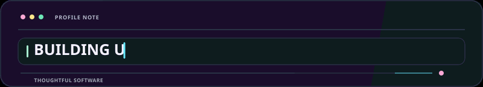
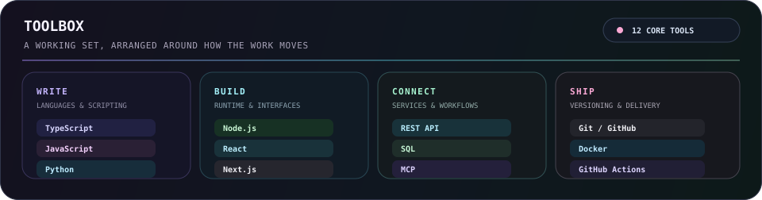
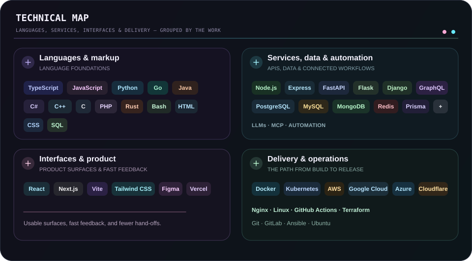
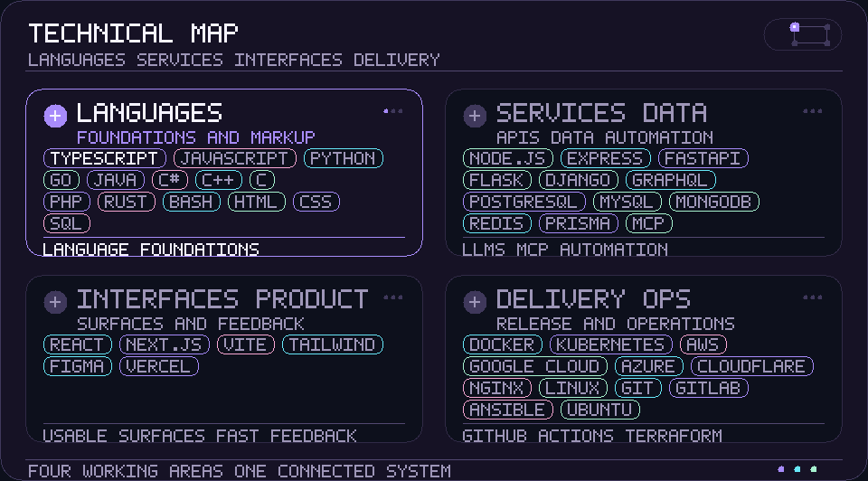

  
  

  <strong>Transformo ideias em realidade com código, curiosidade e cuidado.</strong> 
  Interfaces claras · fluxos conectados · sistemas confiáveis.

  <a href="../../../README.md">🇺🇸 English</a> ·
  <a href="./ko.md">🇰🇷 한국어</a> ·
  <a href="./zh-CN.md">🇨🇳 中文</a> ·
  <a href="./es.md">🇪🇸 Español</a> ·
  <a href="./hi.md">🇮🇳 हिन्दी</a> 
  <a href="./ar.md">🇸🇦 العربية</a> ·
  <strong>🇧🇷 Português</strong> ·
  <a href="./ru.md">🇷🇺 Русский</a> ·
  <a href="./fr.md">🇫🇷 Français</a> ·
  <a href="./id.md">🇮🇩 Bahasa Indonesia</a>

## Sobre

Transformo ideias iniciais em superfícies de produto úteis, ferramentas conectadas e fluxos de trabalho que continuam fáceis de entender enquanto crescem.

  

### O que construo

- **Experiências de produto** — Interfaces e fluxos que deixam claro o próximo passo
- **Trabalho conectado** — APIs, integrações e automação que reduzem repasses rotineiros
- **Feito para evoluir** — Bases pequenas e fáceis de testar, mudar e manter

### Como trabalho

- **Clareza primeiro** — Tornar o próximo passo evidente.
- **Manter a curiosidade** — Deixar espaço para descobrir caminhos melhores.
- **Continuar melhorando** — Deixar pequenas iterações se acumularem.

Útil. Claro. Sempre melhor.

## Stack

Um conjunto prático, agrupado pelo trabalho que ajuda a resolver e não como uma lista de verificação.

- **Escrever** — TypeScript, JavaScript, Python
- **Construir** — Node.js, React, Next.js
- **Conectar** — REST API, SQL, MCP
- **Entregar** — Git, Docker, GitHub Actions

<strong>Explorar o stack visual</strong>

 

<strong>Ferramentas principais</strong>

<strong>Mapa técnico</strong>

<strong>Em movimento</strong>

- **Linguagens e marcação** — TypeScript, JavaScript, Python, Go, Java, C#, C++, C, PHP, Rust, Bash, HTML, CSS, SQL
- **Serviços, dados e automação** — Node.js, Express, FastAPI, Flask, Django, GraphQL, PostgreSQL, MySQL, MongoDB, Redis, Prisma, LLMs, MCP, automação
- **Interfaces e produto** — React, Next.js, Vite, Tailwind CSS, Figma, Vercel
- **Entrega e operações** — Docker, Kubernetes, AWS, Google Cloud, Azure, Cloudflare, Nginx, Linux, GitHub Actions, Terraform, Git, GitLab, Ansible, Ubuntu

## Projetos

O trabalho público permanece fácil de explorar; o trabalho privado fica intencionalmente oculto. Os mapas abaixo são atualizados apenas a partir de repositórios e issues públicos.

[Ver repositórios públicos](https://github.com/KS-GG-AI?tab=repositories) · [Ver issues públicos acompanhados](https://github.com/issues?q=user%3AKS-GG-AI+is%3Aissue+is%3Aopen)

<strong>Explorar projetos e roteiros</strong>

 

<strong>Mapa de projetos</strong>

Somente metadados públicos. Nomes e metadados privados nunca são exibidos.

<strong>Roteiro do projeto</strong>

<strong>Roteiro de desenvolvimento</strong>

Usa somente issues públicos do GitHub. Adicione um rótulo <code>roadmap:*</code> e um <code>stage:*</code> a um issue público para exibi-lo.

## Contato

Para trabalho público, comentários ou uma visão mais próxima da implementação, estes são os pontos de partida mais claros.

[Perfil do GitHub](https://github.com/KS-GG-AI) · [Repositórios públicos](https://github.com/KS-GG-AI?tab=repositories) · [Abrir um issue](https://github.com/KS-GG-AI/KS-GG-AI/issues/new) · [Código do perfil](https://github.com/KS-GG-AI/KS-GG-AI)
