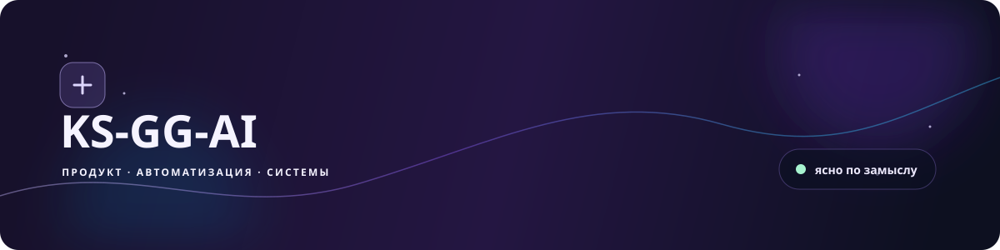
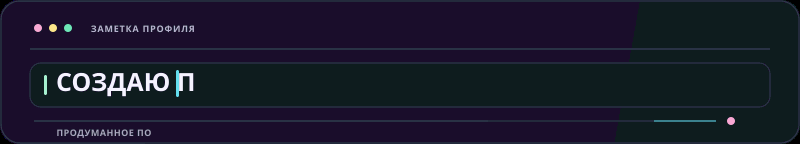
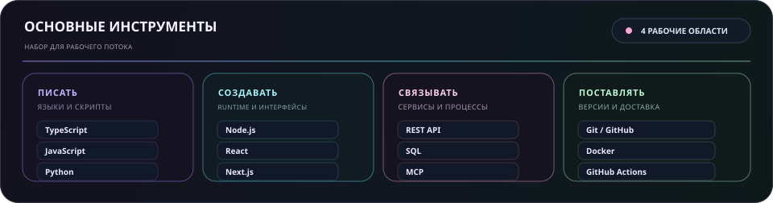
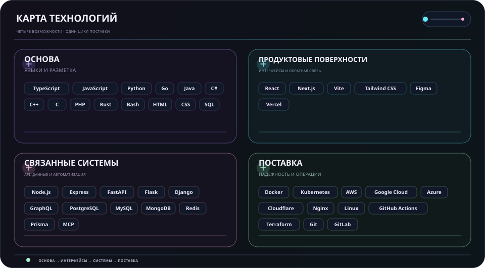
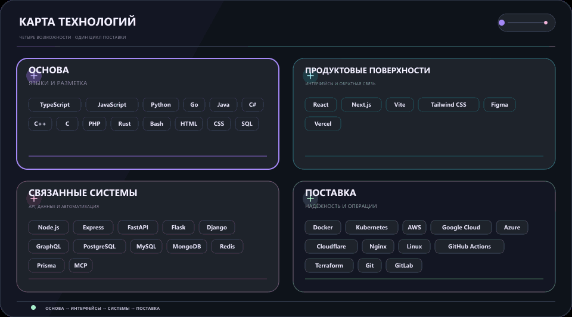

  <picture>
    <source media="(max-width: 840px)" srcset="../../assets/locales/ru/identity/hero-compact.svg" />
    
  </picture>
  <picture>
    
  </picture>

  <strong>Превращаю идеи в реальность с помощью кода, любопытства и внимания к деталям.</strong> 
  Понятные интерфейсы · связанные процессы · надёжные системы.

  <a href="../../../README.md">🇺🇸 English</a> ·
  <a href="./ko.md">🇰🇷 한국어</a> ·
  <a href="./zh-CN.md">🇨🇳 中文</a> ·
  <a href="./es.md">🇪🇸 Español</a> ·
  <a href="./hi.md">🇮🇳 हिन्दी</a> 
  <a href="./ar.md">🇸🇦 العربية</a> ·
  <a href="./pt-BR.md">🇧🇷 Português</a> ·
  <strong>🇷🇺 Русский</strong> ·
  <a href="./fr.md">🇫🇷 Français</a> ·
  <a href="./id.md">🇮🇩 Bahasa Indonesia</a>

## Обо мне

Превращаю ранние идеи в полезные продуктовые поверхности, связанные инструменты и процессы, которые остаются понятными по мере роста.

  <picture>
    
  </picture>

### Что я создаю

- **Продуктовый опыт** — Интерфейсы и сценарии, в которых следующий шаг очевиден
- **Связанная работа** — API, интеграции и автоматизация, сокращающие ручную передачу работы
- **Основа для развития** — Небольшие основы, которые легко тестировать, менять и поддерживать

### Как я работаю

- **Сначала ясность** — Сделать следующий шаг очевидным.
- **Оставаться любопытным** — Оставлять место для поиска лучших решений.
- **Продолжать улучшать** — Позволять небольшим итерациям накапливаться.

Полезно. Понятно. Всё лучше.

## Стек

Практический набор, сгруппированный по задачам, которые он помогает решать, а не как контрольный список.

- **Основа** — TypeScript, JavaScript, Python, Go
- **Продуктовые поверхности** — React, Next.js, Vite, Tailwind CSS, Figma
- **Связанные системы** — Node.js, REST API, PostgreSQL, MCP
- **Поставка и надёжность** — Git, Docker, GitHub Actions, облачные платформы

<strong>Открыть визуальный стек</strong>

 

<strong>Основные инструменты</strong>

<picture>
  <source media="(max-width: 840px)" srcset="../../assets/locales/ru/visuals/toolbox-compact.svg" />
  
</picture>

<strong>Техническая карта</strong>

<picture>
  <source media="(max-width: 840px)" srcset="../../assets/locales/ru/visuals/technology-stack-compact.svg" />
  
</picture>

<strong>В движении</strong>

<picture>
  <source media="(max-width: 840px)" srcset="../../assets/locales/ru/motion/technology-stack-compact.gif" />
  
</picture>

- **Языки и разметка** — TypeScript, JavaScript, Python, Go, Java, C#, C++, C, PHP, Rust, Bash, HTML, CSS, SQL
- **Сервисы, данные и автоматизация** — Node.js, Express, FastAPI, Flask, Django, GraphQL, PostgreSQL, MySQL, MongoDB, Redis, Prisma, LLMs, MCP, автоматизация
- **Интерфейсы и продукт** — React, Next.js, Vite, Tailwind CSS, Figma, Vercel
- **Поставка и операции** — Docker, Kubernetes, AWS, Google Cloud, Azure, Cloudflare, Nginx, Linux, GitHub Actions, Terraform, Git, GitLab, Ansible, Ubuntu

## Проекты

Публичную работу легко просматривать; приватная работа намеренно скрыта. Карты ниже обновляются только из публичных репозиториев и публичных Issues.

[Посмотреть публичные репозитории](https://github.com/KS-GG-AI?tab=repositories) · [Открыть отслеживаемые публичные issues](https://github.com/issues?q=user%3AKS-GG-AI+is%3Aissue+is%3Aopen)

<strong>Открыть проекты и дорожные карты</strong>

 

<strong>Карта проектов</strong>

<picture>
  
</picture>

Только публичные метаданные. Приватные имена и метаданные никогда не показываются.

<strong>Дорожная карта проекта</strong>

<picture>
  
</picture>

<strong>Дорожная карта разработки</strong>

<picture>
  
</picture>

Используются только публичные GitHub Issues. Добавьте к публичному issue одну метку <code>roadmap:*</code> и одну <code>stage:*</code>, чтобы он появился здесь.

## Контакты

Для публичной работы, обратной связи или более подробного знакомства с реализацией это самые понятные точки входа.

[Профиль GitHub](https://github.com/KS-GG-AI) · [Публичные репозитории](https://github.com/KS-GG-AI?tab=repositories) · [Открыть issue](https://github.com/KS-GG-AI/KS-GG-AI/issues/new) · [Исходники профиля](https://github.com/KS-GG-AI/KS-GG-AI)
