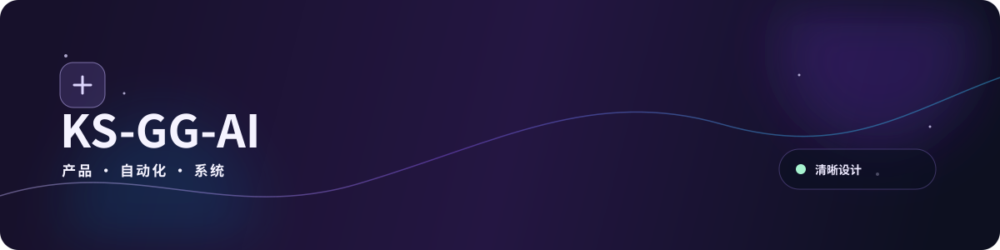
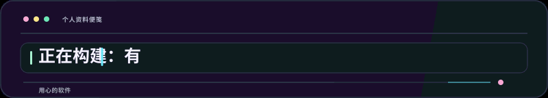
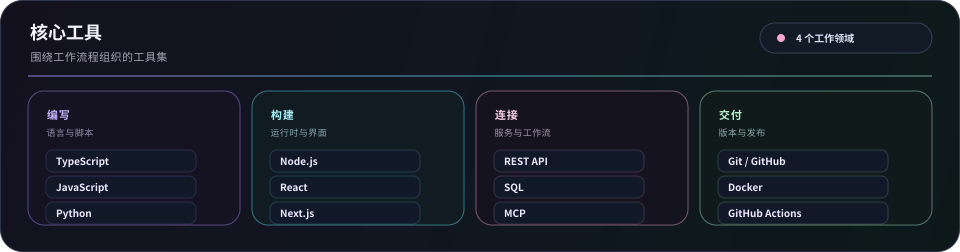
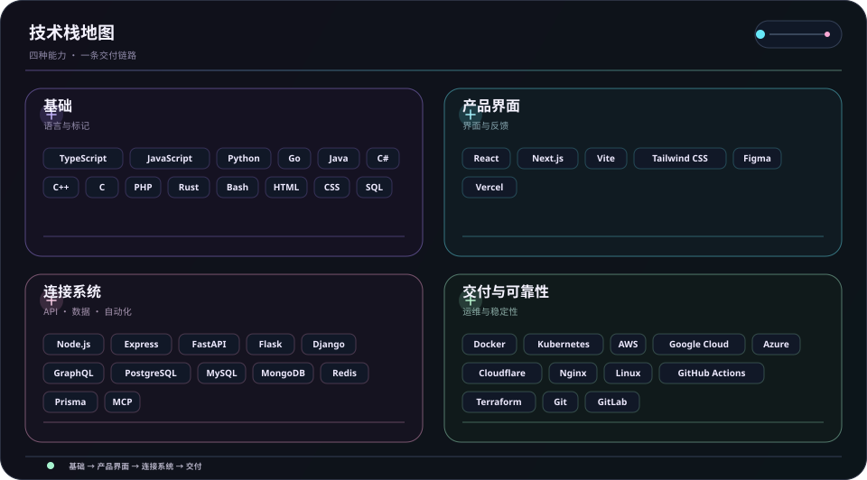
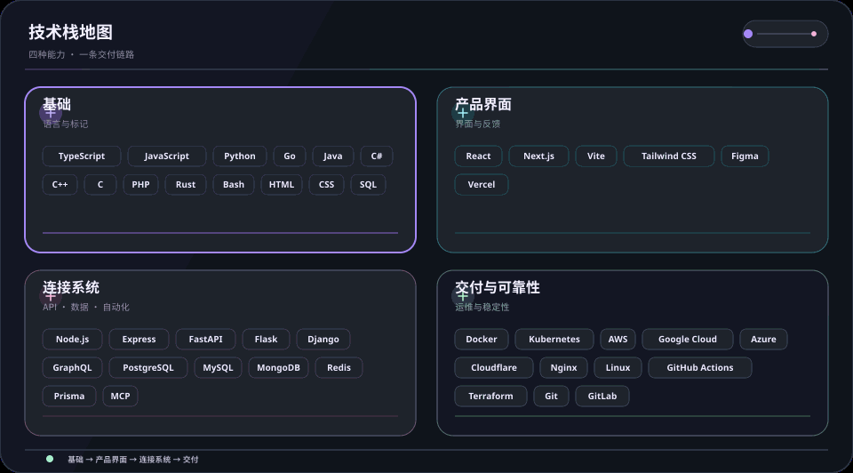

  <picture>
    <source media="(max-width: 840px)" srcset="../../assets/locales/zh-CN/identity/hero-compact.svg" />
    
  </picture>
  <picture>
    
  </picture>

  <strong>用代码、好奇心和细心把想法变成现实。</strong> 
  清晰的界面 · 连贯的工作流 · 可靠的系统

  <a href="../../../README.md">🇺🇸 English</a> ·
  <a href="./ko.md">🇰🇷 한국어</a> ·
  <strong>🇨🇳 中文</strong> ·
  <a href="./es.md">🇪🇸 Español</a> ·
  <a href="./hi.md">🇮🇳 हिन्दी</a> 
  <a href="./ar.md">🇸🇦 العربية</a> ·
  <a href="./pt-BR.md">🇧🇷 Português</a> ·
  <a href="./ru.md">🇷🇺 Русский</a> ·
  <a href="./fr.md">🇫🇷 Français</a> ·
  <a href="./id.md">🇮🇩 Bahasa Indonesia</a>

  
  
  
  

## 关于

把早期想法做成易用的产品界面、连贯的工具和即使成长后也容易理解的工作流。

  <picture>
    
  </picture>

### 我构建什么

- **产品体验** — 让下一步一目了然的界面和流程
- **连接的流程** — 通过 API、集成和自动化减少重复交接
- **可持续演进** — 易于测试、调整和维护的小型基础

### 工作方式

- **清晰优先** — 让下一步一目了然。
- **保持好奇** — 为发现更好的方法留出空间。
- **持续改进** — 让小的迭代不断累积。

有用。清晰。持续变得更好。

## 技术栈

这是一套按实际工作来组织的工具，而不是一张清单。

- **基础** — TypeScript、JavaScript、Python、Go
- **产品界面** — React、Next.js、Vite、Tailwind CSS、Figma
- **连接系统** — Node.js、REST API、PostgreSQL、MCP
- **交付与可靠性** — Git、Docker、GitHub Actions、云平台

<strong>查看可视化技术栈</strong>

 

<strong>核心工具</strong>

<picture>
  <source media="(max-width: 840px)" srcset="../../assets/locales/zh-CN/visuals/toolbox-compact.svg" />
  
</picture>

<strong>技术地图</strong>

<picture>
  <source media="(max-width: 840px)" srcset="../../assets/locales/zh-CN/visuals/technology-stack-compact.svg" />
  
</picture>

<strong>动态地图</strong>

<picture>
  <source media="(max-width: 840px)" srcset="../../assets/locales/zh-CN/motion/technology-stack-compact.gif" />
  
</picture>

- **语言与标记** — TypeScript, JavaScript, Python, Go, Java, C#, C++, C, PHP, Rust, Bash, HTML, CSS, SQL
- **服务、数据与自动化** — Node.js, Express, FastAPI, Flask, Django, GraphQL, PostgreSQL, MySQL, MongoDB, Redis, Prisma, LLMs, MCP, 自动化
- **界面与产品** — React, Next.js, Vite, Tailwind CSS, Figma, Vercel
- **交付与运维** — Docker, Kubernetes, AWS, Google Cloud, Azure, Cloudflare, Nginx, Linux, GitHub Actions, Terraform, Git, GitLab, Ansible, Ubuntu

## 项目

公开作品保持易于浏览，私有工作则有意隐藏。组织地图中的私有仓库仅以遮蔽标签显示，路线图只根据公开 Issue 更新。

### 精选系统与解决方案

<table>
  <tr>
    <td width="50%" valign="top">
      <h4>🛡️ <a href="https://github.com/KS-GG-AI/adguardhome-homelab-stack">adguardhome-homelab-stack</a></h4>
      
<em>应用 ZRAM 压缩交换、TCP BBR、HTTP/2 及 HTTP/3 (QUIC/DoQ)、独立物理节点无中断隔离的高性能 AdGuard Home 生产级技术栈。</em>

      

        
        
        
      

      <ul>
        <li><strong>⚡ 性能优化</strong>: 1GB ZRAM (zstd) 内存压缩交换 (swappiness 180, page-cluster 0) + 7.5MB 大容量 UDP 套接字缓冲区</li>
        <li><strong>🔒 现代协议</strong>: 端口 443 HTTP/2 管理界面 + 端口 853 DNS-over-QUIC (DoQ)/DoT (有效期至 2046 年的 20 年自签名 SAN 证书)</li>
        <li><strong>🏛️ 无中断隔离</strong>: 物理节点间无依赖 Zero-SPOF 独立运行，客户端 1 秒极速 DNS 故障切换</li>
        <li><strong>🌐 智能分流</strong>: 集成 ByeDPI SOCKS5 代理与轻量 Python PAC 守护进程实现规则分流</li>
        <li><strong>🌍 多语言支持</strong>: 完整提供 10 种语言本地化文档 (<a href="https://github.com/KS-GG-AI/adguardhome-homelab-stack/blob/main/locales/zh-CN.md">中文文档</a>、한국어、English 等)</li>
      </ul>
    </td>
    <td width="50%" valign="top">
      <h4>🗺️ <a href="https://github.com/KS-GG-AI/github-org-map-public">github-org-map-public</a></h4>
      
<em>为 GitHub 账号及组织自动生成工作区与仓库拓扑图，并兼顾隐私保护的开源项目。</em>

      

        
        
        
      

      <ul>
        <li><strong>🔄 定时自动化</strong>: 基于 GitHub Actions 每日自动执行，安全隔离无令牌泄露</li>
        <li><strong>🛡️ 隐私保护</strong>: 自动遮蔽私有仓库名称与标识，仅对外展示公开技术架构</li>
        <li><strong>🎨 动态可视化</strong>: 生成全账号动态 SVG 图表与动效 GIF 架构图</li>
      </ul>
    </td>
  </tr>
</table>

[浏览公开仓库](https://github.com/KS-GG-AI?tab=repositories) · [浏览公开跟踪 Issue](https://github.com/issues?q=user%3AKS-GG-AI+is%3Aissue+is%3Aopen)

<strong>查看项目与路线图</strong>

 

<strong>组织地图</strong>

  <a href="https://github.com/KS-GG-AI/github-org-map-public">
    <picture>
      
    </picture>
  </a>

私有仓库仅以遮蔽标签的形式显示。

<strong>项目路线图</strong>

<picture>
  
</picture>

<strong>开发路线图</strong>

<picture>
  
</picture>

仅使用公开 GitHub Issue。为公开 Issue 添加一个 <code>roadmap:*</code> 标签和一个 <code>stage:*</code> 标签即可显示。

## 联系

如需查看公开工作、提交反馈或了解实现细节，可从下面的入口开始。

[GitHub 个人资料](https://github.com/KS-GG-AI) · [公开仓库](https://github.com/KS-GG-AI?tab=repositories) · [创建 Issue](https://github.com/KS-GG-AI/KS-GG-AI/issues/new) · [个人资料源码](https://github.com/KS-GG-AI/KS-GG-AI)
