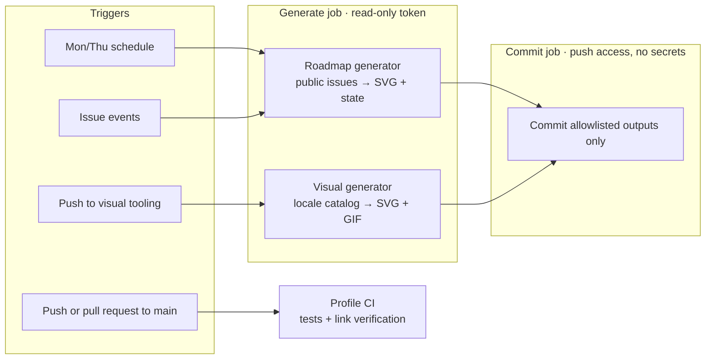

# Profile Architecture

This repository is the public GitHub profile for **KS-GG-AI**. It is a small, self-maintaining system: ten localized profile pages, generated SVG and GIF visuals, and public roadmaps rebuilt from labeled GitHub issues. Everything a reader sees is served from this repository; no third-party image or font service is involved.

[← Back to the profile](../../README.md)

## Layout

| Path | Purpose |
| --- | --- |
| `README.md` | English profile page, the one GitHub renders on the profile. |
| `profile/content/locales/*.md` | The nine other languages, kept in structural parity with `README.md`. |
| `profile/assets/` | Badges, identity art, project banners, and per-locale generated visuals under `locales/<code>/`. |
| `profile/automation/visuals/` | TypeScript generator for the localized hero, toolbox, technology map, and animated GIFs. |
| `profile/automation/visuals/visual-locales.json` | The single catalog of localized visual and roadmap copy. |
| `profile/automation/roadmaps/` | TypeScript roadmap generator, its tests, and the profile link verifier. |
| `profile/data/roadmap-state.json` | Last public roadmap snapshot; unchanged input keeps the same revision. |
| `profile/docs/roadmaps/` | Roadmap requirements, design, and plan (Korean). |

## Pipelines



| Workflow | Runs on | Does |
| --- | --- | --- |
| `refresh-roadmaps.yml` | Schedule, manual, issue events | Reads public issues, renders both roadmaps in every locale, bumps the README cache key, commits only when the public state changed. |
| `refresh-localized-visuals.yml` | Manual, pushes to visual tooling | Regenerates the localized visuals and commits them. |
| `profile-ci.yml` | Pushes and pull requests to `main` | Runs both test suites and verifies every local link and image across all profile pages. |

## Security model

- **Split jobs.** Jobs that run dependency code get a read-only token and `persist-credentials: false`. The job that can push runs no dependency code and receives no secrets; it only commits an allowlist of generated paths.
- **Pinned actions.** Every action is pinned to a full commit SHA, and the tests fail if a workflow drifts from that.
- **No install scripts.** Tooling installs with `npm ci --ignore-scripts`.
- **Public data only.** The roadmap reads public, non-fork, non-archived repositories and stores issue number, title, and repository only; never bodies, comments, authors, or anything private. Remote text is trimmed, length-limited, and XML-escaped before it reaches an SVG.
- **Masked private work.** The organization map comes from [github-org-map](https://github.com/KS-GG-AI/github-org-map), which shows private repositories only as masked labels.

## Adding a roadmap item

The roadmaps show open public issues that carry one `roadmap:*` label and one `stage:*` label:

| Project lane | Development stage |
| --- | --- |
| `roadmap:now` · `roadmap:next` · `roadmap:later` | `stage:plan` · `stage:build` · `stage:verify` · `stage:ship` |

Anyone can propose an item with the [roadmap issue form](https://github.com/KS-GG-AI/KS-GG-AI/issues/new?template=roadmap-item.yml). The form does not apply labels itself: a maintainer applies them after triage, so only reviewed items reach the public profile.

## Localization

Each language has a page in `profile/content/locales/` and a directory in `profile/assets/locales/`. Visual and roadmap copy lives in `visual-locales.json`; the page text lives in each Markdown file. Arabic renders right to left in both the page and the generated SVGs.

Every page must keep the same disclosure panels as `README.md`, link to all nine other languages, and use only its own locale's assets. The tests and link verifier enforce these rules.

## Local checks

```sh
npm ci --prefix profile/automation/roadmaps --ignore-scripts
npm ci --prefix profile/automation/visuals --ignore-scripts
npm run --prefix profile/automation/roadmaps roadmaps:test
npm run --prefix profile/automation/visuals visuals:test
npm run --prefix profile/automation/roadmaps links:verify
```

To regenerate outputs locally, use `roadmaps:update` (reads the public GitHub API; set `GITHUB_TOKEN` to raise the rate limit) or `visuals:update` (needs Noto fonts for full locale coverage).
