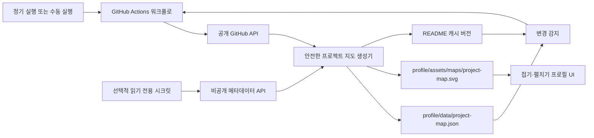

# 프로젝트 지도 TRD

## 1. 아키텍처 개요

REQ-01, REQ-03, REQ-04, REQ-05, REQ-06에 대응한다. 생성기는 공개 정보만 직접 표시하고, 비공개 응답은 메모리에서 개수와 익명 노드로 즉시 변환한다.

## 2. 기술 스택과 선택 이유

- Node.js 표준 라이브러리와 내장 `fetch`: 기존 생성 스크립트와 같은 런타임이며 새 의존성이 없다.
- 정적 SVG: GitHub README의 폭 변화에 안전하고, 이미지 자산을 저장소 안에서 제공할 수 있다.
- 480px 기준 세로 흐름 SVG와 README의 `width="480"`: 넓은 프로필에서는 과도한 높이를 피하고, 좁은 화면에서는 카드 라벨을 읽을 수 있게 한다.
- GitHub Actions: 프로필 저장소 자체에서 정기·수동 갱신과 생성물 커밋을 수행한다.

대안인 외부 Worker와 GitHub App 전용 구조는 별도 계정·운영 설정이 필요해 이번 기본 구현에서 제외한다. 비공개 범위가 필요해지면 선택 저장소에만 설치한 GitHub App의 `Metadata: read` 권한이 장기적으로 더 안전한 대안이다.

## 3. 데이터 모델

`profile/data/project-map.json`에는 다음 안전한 정보만 둔다.

- `username`
- `renderVersion`
- `revision`
- `generatedAt`
- 공개 프로젝트의 이름과 주 언어
- 비공개 연결 상태, 개수, 익명 레이블

비공개 원본 이름·URL·설명·언어·수정 시각은 메모리 밖으로 저장하지 않는다.

## 4. 인터페이스·API 규약

- 공개 조회: `GET /users/{username}/repos?type=owner`
- 선택적 비공개 조회: `GET /user/repos?affiliation=owner&visibility=all`
- 입력 환경 변수: `PROFILE_USERNAME`, `PROFILE_REPOSITORY_READ_TOKEN`
- 출력: `profile/assets/maps/project-map.svg`, `profile/data/project-map.json`, README의 `project-map.svg?v={revision}`

REQ-01, REQ-04, REQ-06에 대응한다.

## 5. 상태와 저장소

- SVG와 JSON은 프로필 저장소에 커밋한다.
- 원본 API 응답은 저장하거나 로그로 출력하지 않는다.
- 의미 있는 지도 상태가 같으면 기존 `generatedAt`과 `revision`을 유지해 불필요한 커밋을 만들지 않는다.

## 6. 오류 처리와 실패 모드

- 공개 API 호출 실패: 생성 실패로 종료하고 기존 자산을 보존한다.
- 선택적 비공개 토큰 호출 실패: 공개 전용 상태로 덮어쓰지 않고 실패로 종료해 기존 보호 상태를 보존한다.
- 비공개 토큰 미설정: 공개 지도만 생성하며 보호 영역은 이름 없는 안내 상태로 유지한다.

## 7. 보안 요구

- 토큰은 GitHub Actions 시크릿으로만 주입한다.
- 워크플로는 생성 결과 커밋에 필요한 `contents: write`만 가진다.
- GitHub Actions 참조는 검증한 전체 커밋 SHA로 고정해 태그 변경에 따른 공급망 위험을 줄인다.
- 비공개 읽기 토큰은 선택 저장소의 읽기 전용 최소 권한을 사용한다.
- 원본 비공개 문자열은 SVG, JSON, README, 로그, 아티팩트, 커밋 메시지에 넣지 않는다.
- 사용자 입력이나 원격 메타데이터는 XML 이스케이프와 길이 제한 후 렌더링한다.

REQ-02, REQ-06에 대응한다.

## 8. 성능·용량 목표

- 공개 저장소 100개 이하에서 한 번의 페이지 요청으로 생성한다.
- SVG에 최대 3개의 공개 노드와 3개의 비공개 익명 노드만 렌더링한다.
- 노드 수에 맞춰 SVG 높이를 계산해 비어 있는 하단 공간을 만들지 않는다.
- 생성 SVG는 프로필 렌더링에 적합한 작은 정적 자산으로 유지한다.

## 9. 배포·운영 환경

GitHub Actions의 Ubuntu runner에서 Node.js 22를 사용한다. 화·금 UTC 03:17 정기 실행과 수동 실행을 제공한다. 변경된 생성 파일과 README만 커밋하므로 배포는 프로필 저장소 `main` 갱신으로 끝난다.

## 10. 외부 의존성과 그 대안

- GitHub REST API: 공개 저장소 자동 조회에 필요하다.
- 선택적 `PROFILE_REPOSITORY_READ_TOKEN`: 비공개 개수 자동 반영에만 필요하다.
- GitHub App: 더 작은 범위와 짧은 수명의 토큰이 필요한 경우의 권장 대안이다.

## 11. 미검증 가정

- 읽기 전용 비공개 토큰은 아직 구성되지 않았다. 따라서 원격 QA는 공개 전용 경로를 기준으로 수행한다.

## 12. 변경 이력

| 버전 | 변경 내용 |
| --- | --- |
| v1 | 정적 SVG, 네이티브 접기 UI, GitHub Actions 자동화 설계 |
| v2 | 좁은 화면 가독성을 위한 세로형 SVG와 고정 폭 표시, 액션 SHA 고정 반영 |
| v3 | API 시간 제한·제한 재시도, README 선검증, 활성 공개 저장소 필터와 job 시간 제한 반영 |

## 13. v3 신뢰성 보강

- 각 GitHub API 요청은 12초 안에 끝나야 하며, 408·429·rate-limit 403·502·503·504와 네트워크 오류만 최대 3회까지 제한 재시도한다. `Retry-After` 또는 rate-limit reset을 우선 반영하되 대기 시간은 5초 이내로 제한한다.
- 401·404·422 등 재시도로 해결되지 않는 응답은 즉시 실패한다. 모든 재시도 뒤에도 실패하면 워크플로가 push 전에 종료되어 기존 원격 지도와 README를 보존한다.
- 생성 전 10개 README의 프로젝트 지도 참조를 모두 읽고 단일 참조 여부를 검증한다. 하나라도 손상되면 JSON·SVG를 쓰지 않는다.
- 기존 JSON은 스키마·revision·시각·공개 및 비공개 상태 형태를 검증한다. 유효하지 않으면 새 API 응답을 기반으로 안전하게 다시 생성한다.
- 지도에는 계정 소유의 공개 저장소 중 포크와 보관 상태가 아닌 항목만 넣는다. 비공개 원본 메타데이터의 비저장 규칙은 변경하지 않는다.
- 워크플로 job은 5분 시간 제한을 둔다. 이는 정상적인 페이지네이션과 생성에는 충분하면서 외부 API 정지로 인한 runner 점유를 막는다.
