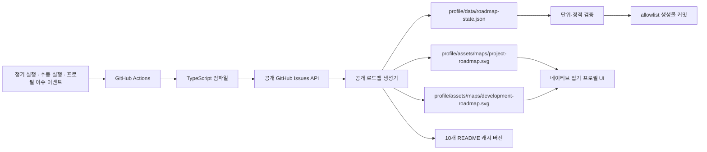

# 공개 로드맵 TRD

## 1. 아키텍처 개요

REQ-01~REQ-08에 대응한다. 워크플로는 공개 계정 API만 읽고, 비공개 API·Projects V2 API·이슈 본문·댓글을 호출하지 않는다.

## 2. 기술 스택과 선택 이유

- TypeScript 7과 Node.js 22: 새 생성기의 입력·출력 계약을 정적으로 검사하고, GitHub Actions에서 컴파일 후 실행한다.
- Node.js 표준 라이브러리와 내장 `fetch`: 런타임 의존성을 늘리지 않고 API·파일·해시를 처리한다.
- 정적 SVG: GitHub README에서 안정적으로 렌더링되며 저장소 안에서 직접 제공된다.
- GitHub Actions: 별도 서버 없이 정기 실행, 수동 실행, 프로필 저장소 이슈 이벤트를 제공한다.

대안인 Projects V2 API는 더 풍부한 보드 상태를 제공하지만 별도의 권한 범위가 필요하다. v1에서는 공개 이슈 라벨이 더 작은 권한과 명확한 데이터 경계를 제공하므로 채택한다.

## 3. 데이터 모델

`profile/data/roadmap-state.json`의 안전한 형태는 다음과 같다.

- `username`, `schemaVersion`, `renderVersion`, `revision`, `generatedAt`
- 공개 소유 저장소 수와 공개 이슈 수
- `projectRoadmap.lanes`: `now`, `next`, `later`와 공개 이슈 제목·저장소·번호
- `developmentRoadmap.stages`: `plan`, `build`, `verify`, `ship`과 공개 이슈 제목·저장소·번호

이슈 URL, 이슈 본문, 댓글, 작성자, 비공개 저장소 및 비공개 이슈 데이터는 저장하지 않는다.

## 4. 인터페이스·API 규약

- 공개 저장소: `GET /users/{username}/repos?type=owner&sort=updated`
- 공개 이슈: `GET /repos/{owner}/{repo}/issues?state=open`
- 입력 환경 변수: `PROFILE_USERNAME`, 선택적 `GITHUB_TOKEN`
- 라벨 계약: `roadmap:now`, `roadmap:next`, `roadmap:later`, `stage:plan`, `stage:build`, `stage:verify`, `stage:ship`
- 출력: `profile/data/roadmap-state.json`, `profile/assets/maps/project-roadmap.svg`, `profile/assets/maps/development-roadmap.svg`, README의 `?v={revision}`

REQ-01~REQ-06에 대응한다.

## 5. 상태와 저장소

의미 상태는 API에서 정규화한 공개 저장소·공개 이슈·라벨 분류로만 구성한다. 기존 JSON이 유효하고 의미 상태가 같으면 기존 `generatedAt`·`revision`·SVG·README 캐시 버전을 보존한다. 하나의 README 참조가 손상되거나 API 호출이 실패하면 쓰기 전에 종료한다.

## 6. 오류 처리와 실패 모드

- 12초 타임아웃과 최대 3회 제한 재시도를 사용한다.
- 408·429·rate-limit 403·502·503·504·네트워크 오류만 재시도한다.
- 401·404·422·비정상 JSON은 즉시 실패한다.
- 공개 이슈가 0개인 것은 실패가 아니라 명시적 빈 상태다.
- 출력 또는 README 선검증이 실패하면 JSON·SVG·README 어느 것도 쓰지 않는다.
- 동시에 실행되는 프로젝트 지도·로드맵 갱신은 공통 concurrency group으로 직렬화한다.

## 7. 보안 요구

- 요청 헤더의 토큰은 Actions 환경 변수에서만 읽고 로그에 출력하지 않는다.
- 소스는 공개 API URL만 사용하며, 비공개 `user` endpoint를 호출하지 않는다.
- 원격 텍스트는 공백 정리·길이 제한·XML 이스케이프 후에만 SVG에 넣는다.
- SVG에는 외부 이미지, 스크립트, 이벤트 속성, 원격 폰트를 넣지 않는다.
- 워크플로는 `contents: write`, `issues: read`만 명시하고, 생성물 allowlist만 스테이징한다.
- Actions 참조는 전체 커밋 SHA로 고정한다.

## 8. 성능·용량 목표

- 저장소와 이슈 페이지는 페이지당 100개로 읽는다.
- 각 프로젝트 로드맵 lane에는 최대 2개, 각 개발 단계에는 최대 1개 공개 항목을 렌더링한다.
- 480px SVG에서 본문 글자는 14px 이상을 사용해 좁은 화면에서도 읽을 수 있게 한다.
- 항목이 더 많으면 `+ N more`로 집계하고 SVG 높이는 고정된 읽기 쉬운 세로 레이아웃을 유지한다.

## 9. 배포·운영 환경

Node.js 22가 설치된 GitHub Actions Ubuntu runner에서 `npm ci --prefix profile/automation/roadmaps --ignore-scripts`, 컴파일, 생성, 테스트 순서로 실행한다. 월·목 UTC 03:23의 예약 실행과 수동 실행을 제공한다. 기본 브랜치의 프로필 저장소 이슈 이벤트는 빠른 동기화를 보조하고, 다른 공개 저장소 변경은 예약 실행이 수집한다.

## 10. 외부 의존성과 그 대안

- GitHub REST API: 공개 이슈 기반 상태 수집에 필요하다.
- TypeScript와 Node 타입 정의: 개발·검증 시 정적 타입 검사에만 사용한다.
- GitHub Projects V2: 추후 공개 보드를 표현해야 할 때 별도 읽기 전용 권한으로 검토한다.

## 11. 미검증 가정

- 현재 계정에는 라벨이 붙은 공개 이슈가 없다. 첫 생성물은 빈 상태가 정상임을 표시한다.
- 다른 공개 저장소에 동일 라벨이 추가될 때의 실제 항목 밀도는 아직 관측되지 않았다.

## 12. 변경 이력

| 버전 | 변경 내용 |
| --- | --- |
| v1 | 공개 이슈 라벨, TypeScript 생성기, 정적 SVG, Actions 자동화 설계 |
| v2 | 긴 다국어 제목 절단, 초과 항목 집계, 캐시 안전 렌더 버전과 원격 검증 결과 반영 |
